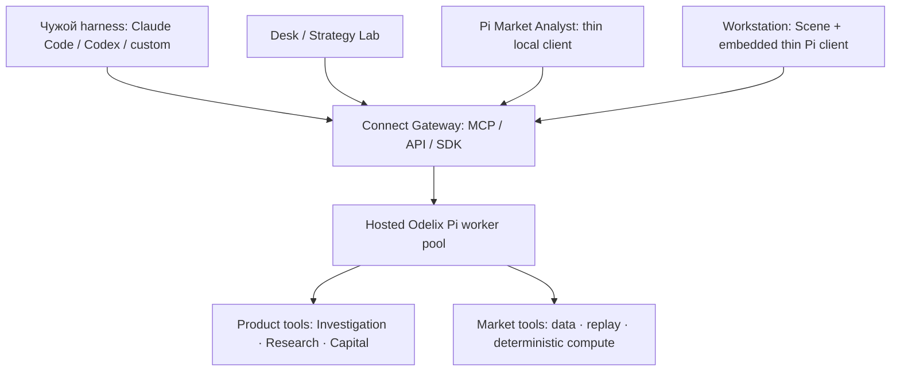
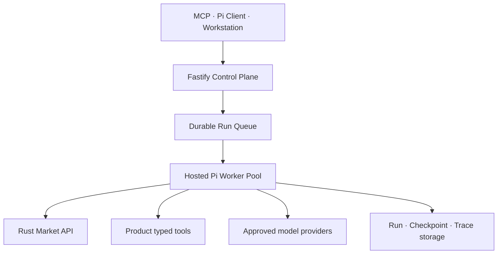
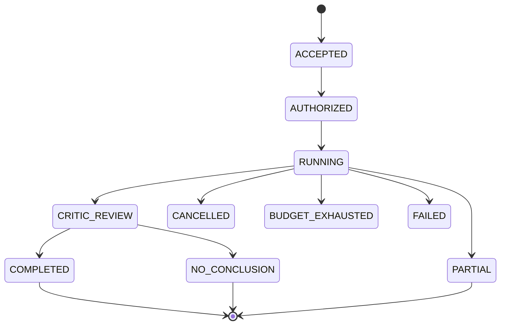
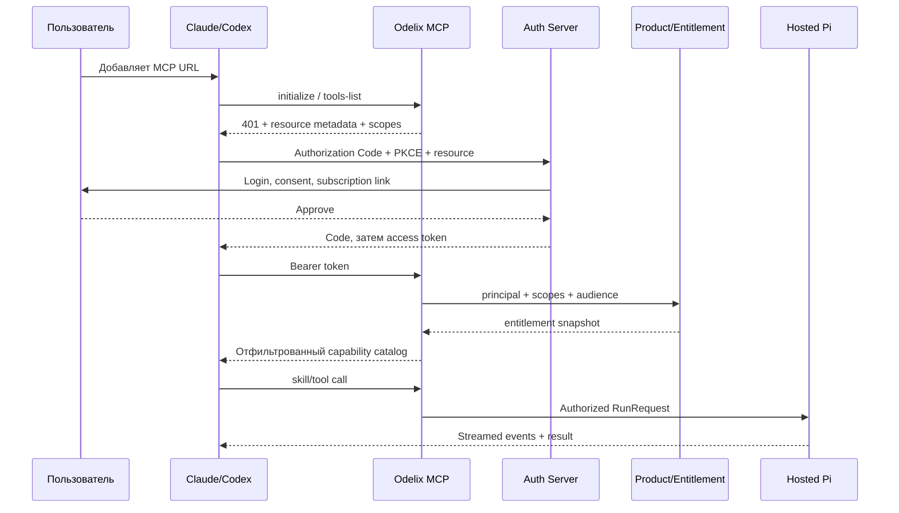
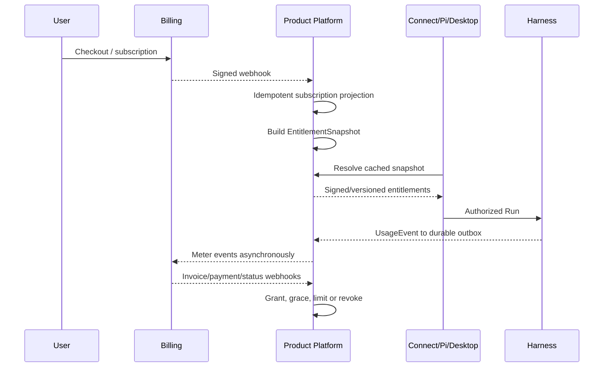
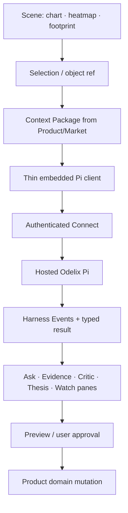

# Odelix AI Harness and Intelligence Platform

> **Текущая редакция документа: r15.11, 28 сентября 2026.** Добавлен ранний external-data scope; исходные исторические срезы ниже датированы отдельно. Изменение спецификации не является выполнением runtime/источниковой приёмки.

> **Основа и reuse текущей редакции:** [локальная карта внешних компонентов и адаптеров](DEVELOPMENT.md#implementation-basis). Там указаны источник, режим использования, наши модули/пути, задачи и ограничения. Кандидат не установленная зависимость; этот предметный документ не требует реализации библиотечной механики с нуля.


> Текущий пакет r15.11 · 28.09.2026. Независимая версия предметной спецификации и датированное происхождение указаны ниже. Нормативные gates — локальный CONTEXT; старые source measurements не текущие замеры.

**Уточнение scope Research: r12.1 · 2026-09-18.** Пользовательские примеры не определяют встроенную стратегию или обязательный dataset; статус реализации не меняется.

**Редакция документа:** r15.11 · 2026-09-28 · PROPOSED. Исходная версия сохранена в истории; runtime не подтверждён.
**Дата:** 2026-09-28  
**Статус:** `PROPOSED / NOT IMPLEMENTATION EVIDENCE`  
**Владелец решения:** Founder  
**Основной repository:** `odelix-harness` — maintained fork `earendil-works/pi`  
**Связанные runtimes:** `odelix-market`, `odelix-product`, `odelix-workstation`, `odelix-web`  
**Назначение документа:** детальная целевая спецификация AI-доменной области,
коммерческих способов доставки и плана реализации. Это основной полный источник AI-домена в данном репозитории. Локальный DEVELOPMENT описывает процесс, зависимости и снимок очереди; фактический допуск определяет назначенная задача и согласованные артефакты.

---

## 0. Резюме решения

Odelix строит не «чат внутри терминала» и не набор промптов. Он строит единую **Odelix Intelligence Platform**, где maintained fork Pi является самим agent harness, а рыночные данные, детерминированные вычисления, доказательные процедуры и накопленная методология доступны через четыре продуктовые поверхности.

| Поверхность | Что получает клиент | Где исполняется интеллект | Что устанавливается клиенту |
|---|---|---|---|
| **Odelix Connect** | Data/Compute tools и управляемые Odelix Skills в Claude Code, Codex или собственном harness | Crown-jewel workflows — в hosted Pi; вычисления — Market/Product services | Только URL удалённого MCP/API и, опционально, тонкий open/client plugin |
| **Odelix Desk / Strategy Lab** | Web workspace для всех основных и custom strategies, experiments, paper state | Те же hosted Skills и детерминированные Market/Product services | Browser client без private procedures |
| **Odelix Pi Market Analyst** | Готовая специализированная Pi-система для исследования рынка | User/local workflows — в thin licensed Pi build; вся Odelix crown-jewel machinery — только в hosted Pi | Подписанная proprietary client-сборка Pi без private skills/hooks/agents/rubrics |
| **Odelix Workstation** | Полный market workstation: Scene, heatmap, footprint, evidence, Thesis, Watch и Pi-native UX | Локальный Pi client/session runtime обслуживает UX; полный Odelix workflow исполняет hosted Pi | Desktop application с thin embedded Pi client и Connect bridge |

Канонические решения:

1. **Pi fork и есть harness.** Над Pi нет wrapper-harness, `AgentKernelPort`, Pi-adapter или второго orchestration runtime.
2. **MCP не является ядром бизнеса.** Это одна из проекций Odelix Intelligence API для чужих harness-систем.
3. **Один Skill ID — одна семантика** во всех продуктовых поверхностях. Меняется execution profile, а не смысл workflow.
4. **Скачиваемое можно лицензировать, но нельзя считать секретным.** Настоящие trade secrets остаются server-side.
5. **LLM не является источником рыночной истины.** Market/Product modules владеют данными и правилами; Pi организует исследование, critique и presentation.
6. **У каждого Run один authoritative executor.** Нельзя одновременно исполнять одну процедуру локальным и hosted Pi и затем молча смешивать результаты.
7. **Odelix Procedure-Verified result** возможен только для
   Odelix-managed workflow с pinned versions и полным trace. Внутренний
   статус — `ODELIX_PROCEDURE_VERIFIED`; публичное наименование проходит отдельную
   legal/marketing review. При использовании клиентом отдельных tools в своём
   harness Odelix гарантирует contracts конкретных данных/tools, но не его
   итоговый вывод.
8. Founding Alpha не получает execution-capabilities. Любой переход к PAPER/LIVE требует отдельного activation gate.
9. **Полная Odelix agent machinery никогда не поставляется клиенту.**
   Private Skills, hooks, agents, routing, Critic rubrics, eval corpus и secret
   compute находятся только в server image hosted Pi.
10. **Pi является execution engine, а не готовым SaaS control plane.** Fastify,
    durable queue, worker lifecycle и tenant storage масштабируют hosted Pi, но
    не принимают agentic decisions и не образуют внешний harness.
11. **Market Evidence Plane и Odelix Pi Intelligence Plane равноправны.**
    Первый даёт point-in-time truth и deterministic compute; второй превращает
    их в воспроизводимую процедуру и пользовательскую ценность. Ни один путь не
    объявляется готовым без второго на соответствующем product gate.
12. **Первый пользовательский результат — read-only flow Workstation.** Семантический слой и опционный поток принимаются отдельно. Connect остаётся общей внешней поверхностью; готовность оплаты не блокирует график, исследование или PAPER.

---

## Options and custom research procedures

Odelix is agent-compatible first: remote MCP/raw tools work with user-selected
agents. Managed Pi is optional for a client using raw tools, but the managed-intelligence offer still requires the hosted Pi procedure, Critic and moat-delta gate; it is not optional infrastructure for selling that offer. Preserve hosted-only
private Skills/Critic/eval corpus, trace/result-classification rules and
zero-core-patch/upstream-sync discipline. A local order signer is a non-LLM
security adapter, not a second agent runtime or a place to distribute private Skills.

Options flow: HAR-SKL extracts proposed objective → Product freezes clarified
context → Market MKT-OSC/OPT returns deterministic candidates/scenarios →
HAR-CRT verifies claims/units/residual risk and HAR-TRC records inputs/results.
Prompt must distinguish premium spend from portfolio loss, theoretical mark from
quote, and probability assumptions from measured forecasts. Missing information
or invalid strategy produces abstention/clarification, not invented numbers.

First options Skill is compare/explain over typed candidates. Existing
selection.explain/evidence patterns remain reusable. Historical eval requires
eligible PIT data; current/synthetic compute has explicitly different labels.
Moat delta uses same raw data/tools, blinded graders and pinned episodes, with
uncertainty reported. Numerical authority is never earned by winning that eval.

No order acceptance before PAPER and separately approved LIVE path. RFQ is an
outbound information-bearing capability, not automatically read-only. Wallet,
session-key and economic policy validation occur outside the LLM, rechecked at
execution. Usage cancellation and Run terminal status do not cancel/finalize
orders. Procedure verification is not trading approval or investment safety.

WebMCP is optional browser-context projection; no dependency for Connect launch,
no keys and no bypass of server/Execution policy. Full WebMCP support must be
tested for actual client/browser; do not assume Claude/Codex automatically see it.

---

## 1. Что именно мы продаём

### 1.1 Четыре слоя ценности

| Слой | Содержание | За что платит клиент | Основная защита |
|---|---|---|---|
| Data | point-in-time market state, order book, flow, leverage, options, replay | Качественные нормализованные данные и история | Data rights, capture history, normalization, rate/retention entitlements |
| Compute | deterministic events, features, temporal joins, scene/context compilation | Расчёты, которые сложно корректно повторить | Server-side algorithms, versioned engines, historical corpus |
| Intelligence | Skills, agent teams, Critic, evidence procedures, calibration | Воспроизводимый исследовательский workflow | Hosted Pi, private skills/policies/evals, procedure verification |
| Experience | Pi Market Analyst и Workstation | Новый способ взаимодействия с рынком | Product integration, command/object model, Decision Memory |

### 1.2 Продукт — не «доступ к промптам»

Промпты копируются и быстро коммодитизируются. Продаваемая единица Odelix — это versioned capability:

```text
Capability = data rights
           + deterministic tools
           + skill procedure
           + agent/team policy
           + hooks and guards
           + critic rubric
           + output contract
           + trace/procedure verification
           + eval evidence
```

### 1.3 Самостоятельность трёх продуктовых этажей

| Этаж | Самостоятельная ценность | Promotion в следующий этаж |
|---|---|---|
| Investigation | Объяснить/описать рынок, сформировать Thesis и Watch | Thesis → explicit ResearchHypothesis draft |
| Empirical Discovery | Найти и проверить зависимость без обязательного «почему» | Validated Strategy Version → explicit Sleeve candidate |
| Personal Capital OS | Собрать portfolio/Sleeves, вести ledger, attribution и policies | Не является автоматической активацией execution |

Каждый этаж использует один Pi harness, но имеет отдельные Skills, tools, policies и business owners.

---

## 2. Термины и запреты

### 2.1 Термины

| Термин | Значение |
|---|---|
| **Harness** | Сам Odelix fork Pi: loop, sessions, tools, hooks, skills, agents, teams, memory, traces, evals |
| **Skill** | Versioned процедура с eligibility, шагами, обязательными tools, output schema, stop rules и eval suite |
| **Tool** | Typed capability, которое читает или изменяет domain state через owner contract |
| **Hook** | Исполняемая lifecycle-политика внутри Pi, которая наблюдает, проверяет, преобразует или блокирует шаг |
| **Agent** | Роль с ограниченным контекстом, tools, rubric, budget и output contract |
| **Team** | Условно собираемый набор ролей для конкретного Skill; не постоянный swarm |
| **Mission** | Долгоживущая цель с triggers, checkpoint, dedupe и material-update policy |
| **Run** | Одно version-pinned исполнение Skill или прямого agent request |
| **Procedure-Verified Run** | Run, полностью исполненный Odelix-managed path с полным manifest и пройденными guards; technical state `ODELIX_PROCEDURE_VERIFIED` |
| **Executor profile** | Где фактически исполняется Run: `HOSTED`, `LOCAL` или `EMBEDDED`; crown-jewel Skills разрешают только `HOSTED` |
| **Delivery surface** | Откуда пользователь инициирует Run: `CONNECT`, `DESK`, `PI_CLIENT` или `WORKSTATION`; surface не определяет executor |
| **Entitlement** | Выданное право на feature/data/scope/quota; не равно OAuth scope и не равно agent role |
| **Usage unit** | Биллинговое измерение уже авторизованного действия |

### 2.2 Архитектурные запреты

- Нельзя строить «Odelix Agent Service», который оркестрирует Pi снаружи.
- Нельзя дублировать agent state в Fastify и Pi.
- Нельзя давать LLM прямой доступ к market journal, Product database или exchange credentials.
- Нельзя выводить entitlement из текста prompt, названия тарифа или agent role.
- Нельзя использовать subscription/billing provider как единственный runtime authorization source.
- Нельзя выдавать внутренний chain-of-thought. Trace содержит действия, inputs/outputs tools, evidence, decisions и краткие rationales, но не скрытые рассуждения модели.
- Нельзя продавать локальную поставку как «секретный код, который пользователь не сможет посмотреть».
- Нельзя присваивать `ODELIX_PROCEDURE_VERIFIED` результату, собранному внешним harness из raw tools без managed Skill.
- Нельзя позволять Skill напрямую создавать order или менять капитал в Founding Alpha.
- Нельзя включать private Odelix Skill implementation, agent/team prompt,
  hook policy, Critic rubric или private eval corpus в скачиваемый Pi/Desktop
  artifact.
- Нельзя считать queue, worker manager или Fastify control plane вторым
  harness: они могут планировать и размещать Run, но не решать его внутренние
  steps, agents или tool sequence.

---

## 3. Целевая архитектура

### 3.1 Одна Intelligence Platform, четыре поверхности



`Connect Gateway` не становится harness. Он:

- аутентифицирует principal;
- проверяет OAuth scopes и Odelix entitlements;
- нормализует MCP/API request;
- запускает hosted Skill в том же Pi fork **или** вызывает разрешённый deterministic tool;
- стримит публичные Harness Events;
- записывает usage и audit;
- возвращает versioned result.

### 3.2 Репозиторное владение

| Repository | Владеет | Не владеет |
|---|---|---|
| `odelix-harness` | Private hosted Pi fork, Skills, agents, teams, hooks, tool registry, Critic, traces, evals, Missions; sanitized thin client builds | Market truth, Thesis semantics, billing ledger, portfolio ledger |
| `odelix-market` | capture, book, replay, market/flow/options calculations, scene series | Agent workflow и customer entitlements |
| `odelix-product` | Fastify host, tenant/auth, entitlements, billing projection, Investigation/Research/Capital domain modules, managed mutations | Agent loop и high-rate calculations |
| `odelix-workstation` | React Workstation, Scene, panes, commands, desktop host, thin embedded Pi client/session runtime | Private Odelix workflow, business truth и второй agent loop |
| `odelix-web` | Account, Options Desk / Strategy Lab, share viewer; позднее полный web workstation | Desktop runtime и fork logic |
| `odelix-stack` | Release manifest, deploy, contract federation, ADR, ops | Domain implementation |

### 3.3 Pi fork как единый runtime

Pi позиционируется upstream как Agent Harness с agent runtime, tool calling, state management, multi-provider API и программными режимами SDK/RPC; он расширяется TypeScript extensions, skills, prompt templates и packages. Это делает fork естественной основой, а не временной библиотекой. При этом upstream прямо предупреждает, что Pi по умолчанию работает с правами запустившего процесса и не предоставляет встроенную политику sandbox — Odelix обязан добавить собственные capability boundaries и deployment isolation. [Pi repository](https://github.com/earendil-works/pi), [Pi documentation](https://github.com/earendil-works/pi/blob/main/packages/coding-agent/docs/index.md).

```text
odelix-harness/
├── upstream-derived/                 # Pi packages, pinned upstream commit
├── packages/
│   ├── odelix-runtime/           # HAR-RUN
│   ├── odelix-context/           # HAR-CTX
│   ├── odelix-skills/            # HAR-SKL
│   ├── odelix-capabilities/      # HAR-CAP
│   ├── odelix-model-runtime/     # HAR-MDL
│   ├── odelix-critic/            # HAR-CRT
│   ├── odelix-trace/             # HAR-TRC
│   ├── odelix-evals/             # HAR-EVL
│   ├── odelix-memory/            # HAR-MEM
│   ├── odelix-missions/          # HAR-MSN
│   ├── odelix-connect/           # MCP/API projections; no orchestration
│   ├── odelix-license-client/    # local activation/entitlement lease
│   └── odelix-desktop-bridge/    # embedded events/commands
├── skills/
├── agents/
├── teams/
├── hooks/
├── tools/
├── policies/
├── evals/
├── apps/
│   ├── market-analyst-cli/
│   └── harness-dev/
└── upstream/
    ├── PINNED-COMMIT
    ├── DIVERGENCE-LEDGER.md
    ├── UPSTREAM-SYNC-LOG.md
    └── NOTICES/
```

`odelix-connect` — компонент fork, который проецирует его public contracts в MCP/API. Это не «оболочка над Pi» и не владелец workflow.

Целевой patch surface upstream Pi core равен **нулю**. Odelix-функции
реализуются extensions/packages/hooks и опубликованными Pi extension points.
Любой неизбежный core patch до merge обязан иметь запись в
`DIVERGENCE-LEDGER.md`: затронутые файлы, причину невозможности extension,
совместимые tests, removal/upstreaming plan и owner. Upstream sync — регулярная
операция: ориентир полдня каждые 2–4 недели, только после тестов и без
автоматического production promotion.

На Founding Alpha production composition остаётся модульным монолитом: Fastify
`product-host` импортирует exact private package из `odelix-harness` и
монтирует MCP/REST transport как plugin. Отдельный hosted worker/process
появляется только при измеренной необходимости isolation, queueing или
независимого scaling. Даже тогда это тот же Pi fork и тот же Run contract, а не
второй harness.

### 3.4 Execution profiles

| Profile | Executor | Где живут Skills | Когда применяется |
|---|---|---|---|
| `HOSTED` | Odelix-managed Pi process/worker | Полный private Skill/agent/hook/critic/eval set | Все managed Odelix Skills и procedure verification |
| `LOCAL` | Лицензированная Pi Market Analyst на машине клиента | Только user-owned/public/basic local resources и Connect invocations | Local files, BYOK, custom workflows; не crown-jewel analysis |
| `EMBEDDED` | Sanitized Pi client/session package внутри Workstation | Local UX/session resources и Connect invocations | Scene-native experience; не private workflow execution |

Каждый `RunRequest` содержит `deliverySurface` и `executorProfile` раздельно;
`RunManifest` фиксирует `executorId`. Запуск managed Skill из Local/Embedded
surface создаёт hosted Run. Если local Pi выполнял пользовательский parent
workflow, hosted invocation становится explicit child Run с новым ID и parent
reference, а не скрытым nested loop. Только hosted child может получить
`ODELIX_PROCEDURE_VERIFIED`.

### 3.5 Multi-tenant hosted topology

Pi подходит как execution engine для тысяч клиентов, но не используется как
один глобальный процесс с общей mutable session. Масштабируемая единица —
изолированная `AgentSession`/`HarnessRun`, размещаемая в bounded worker pool.



Pi upstream предоставляет Node.js SDK, `AgentSessionRuntime`, event streaming и
RPC mode; SDK предназначен для same-process type-safe embedding, а RPC — для
process isolation/other languages. Это позволяет начать in-process и позже
перенести тот же runtime contract в workers без замены harness. [Pi SDK](https://github.com/earendil-works/pi/blob/main/packages/coding-agent/docs/sdk.md), [Pi agent core](https://github.com/earendil-works/pi/blob/main/packages/agent/README.md).

### 3.6 Control plane не является harness

`odelix-product`/Fastify владеет SaaS control plane:

- OAuth principal и tenant binding;
- subscription, entitlements, quotas и rate limits;
- `RunRequest` intake, idempotency и cancellation;
- durable queue и worker assignment;
- pinned Harness Version rollout;
- public event streaming;
- Usage Ledger и billing outbox;
- lifecycle Product objects и user-owned memory;
- operational reconciliation.

Fastify **не** выбирает agents, Skill steps, tool order, repair loops, Critic
rubric или final epistemic outcome. Эти решения принимает только Odelix Pi
fork. Queue знает, *когда и где* исполнить Run; Pi знает, *как* его исполнить.

### 3.7 Изоляция session/run

Каждый Run получает собственные:

- `tenantId`, `principalId`, `deliverySurface` и `executorProfile`;
- immutable Context Package refs;
- messages и session tree;
- exact CapabilityGrant;
- tenant-scoped typed tool bindings;
- model/provider binding и credentials reference;
- token/tool/time/COGS budgets;
- cancellation signal;
- trace namespace;
- memory namespace;
- usage reservation;
- checkpoint/version manifest.

Запрещено:

- глобальное mutable agent state между tenants;
- повторное использование Context Package без tenant/asOf validation;
- общий credential object между Runs;
- доступ worker к произвольному tenant storage;
- продолжение session в другом worker без validated checkpoint digest;
- одновременный active turn одной session в двух workers.

Один worker может обслуживать несколько I/O-bound Runs только при доказанной
изоляции и bounded concurrency. Material user-code/shell/filesystem execution
выносится в отдельный sandbox profile до первого такого запуска, независимо от S0–S3; market-analysis workers таких tools
не получают.

### 3.8 Эволюция deployment без смены harness

| Stage | Deployment | Когда | Что остаётся неизменным |
|---|---|---|---|
| `S0` | Fastify импортирует private Pi package in-process | Первые пользователи/Alpha | Run, Skill, Tool, Hook и event contracts |
| `S1` | Несколько Pi worker processes на одном host | Event-loop/memory isolation нужна по метрикам | Тот же package и manifests |
| `S2` | Durable queue + workers на нескольких hosts/containers | Queue/concurrency/SLO требует horizontal scale | Тот же authoritative Pi workflow |
| `S3` | Autoscaled worker pools по workload class | Тысячи active clients и разные cost/latency profiles | Один fork, разные approved worker profiles |
| `S4` | Dedicated sandbox pool | Пользовательский код/плагины/Quant Lab | Core market workers остаются без arbitrary code |

Вынос Pi в process/container не создаёт microservice business boundary. Это
deployment isolation одного runtime.

S4 — независимый security profile, а не обязательный следующий календарный шаг после S3. Sandbox необходим уже на S0, если разрешён пользовательский код.

### 3.9 Durable state

Локальный JSONL/SQLite может использоваться в development и client builds, но
не становится единственной истиной distributed SaaS. Hosted baseline:

| Storage | Содержимое |
|---|---|
| Postgres | Run state, session metadata, leases, budgets, usage, approvals, checkpoints index |
| Object storage | Large Context/Evidence Packages, redacted traces, eval artifacts |
| Durable queue/outbox | Pending Run, event publication, billing submission, retries |
| Optional Redis later | Ephemeral cache, cancellation fan-out, short leases; не durable truth |

Pi worker загружает pinned checkpoint, исполняет bounded stage/turn и durable
commit делает до подтверждения progress, от которого зависит recovery. Worker
crash не должен терять accepted Run или создавать двойной billable execution.

Пример worker assignment:

```json
{
  "runId": "run_123",
  "tenantId": "ten_45",
  "principalId": "usr_9",
  "harnessVersion": "0.4.0",
  "skillId": "odelix.investigate.selection.explain",
  "contextPackageRef": "ctx_789",
  "capabilityGrantRef": "grant_21",
  "entitlementDigest": "sha256:...",
  "budgetReservationRef": "res_33",
  "checkpointRef": null,
  "idempotencyKey": "..."
}
```

### 3.10 Concurrency и capacity

Тысячи подписчиков не означают тысячи одновременных Pi processes. Планируется
по active Runs:

\[
\text{Concurrent Runs} \approx
\text{Accepted Runs per second} \times \text{Average Run duration in seconds}
\]

Например, 10 новых Run/с при среднем времени 20 секунд требуют примерно 200
одновременных Run. Реальный bottleneck может находиться не в Pi loop, а в:

- provider tokens/minute и concurrent request limits;
- стоимости Deep Investigation;
- tool latency и Market/Product capacity;
- Context Package size;
- Node heap/event-loop lag;
- specialist fan-out;
- queue wait и egress.

Стартовая нагрузочная гипотеза — 8–16 I/O-bound active Runs на Node worker;
это **не SLO и не обещание**. Число заменяется benchmark result. Autoscaling
смотрит на queue depth/age, active Runs, event-loop lag, heap, provider limits,
tool latency и cost budget, а не только CPU.

### 3.11 Multi-agent execution at scale

Root Pi Run остаётся authoritative. Specialist roles могут исполняться:

- внутри того же worker для Fast Ask;
- как explicit child Runs в worker pool для Deep Investigation;
- параллельно только в рамках `TeamPolicy.maxConcurrency`;
- с общим parent budget и deadline;
- с typed outputs и deterministic merge order.

Запрещены recursive unbounded spawn, самостоятельное расширение tools/scopes и
«вечные» agent teams. Independent Critic получает отдельный child context и не
читает private scratch/chain-of-thought Lead. Root Run не получает procedure verification,
пока все обязательные child Runs и Critic не имеют valid terminal outcome.

### 3.12 Tripwires для перехода S0 → S1/S2

Переход инициируется измерением, а не ожиданием «тысяч клиентов». Initial
tripwire hypotheses:

- p95 queue wait > 2 s в течение 15 минут;
- event-loop lag p95 > 50 ms на Product Host;
- worker heap не возвращается к steady baseline после completed Runs;
- provider/tool concurrency нельзя безопасно ограничить in-process;
- один Run может повлиять на latency/availability другого tenant;
- требуется независимый deploy/rollback worker version;
- restart Product Host прерывает принятые Runs;
- security review требует process/container isolation.

Достижение tripwire открывает deployment ADR и load evidence; оно не разрешает
изменить Skill semantics или создать новый orchestration framework.

---

## 4. Канонические объекты AI-домена

| Object | Ключевые поля | Владелец |
|---|---|---|
| `HarnessVersionManifest` | forkVersion, upstreamCommit, patchDigest, skillSetDigest, toolContractDigests, policyDigest, evalReport | Harness |
| `SkillDefinition` | skillId, version, mode, eligibility, steps, requiredTools, teamPolicy, outputSchema, stopRules, evalSuite, profiles | Harness |
| `ToolDefinition` | toolId, version, input/output schema, owner, sideEffectClass, requiredScopes, entitlements, costPolicy | Harness registry; semantics у producer |
| `HookDefinition` | hookId, phase, priority, failMode, input/output, policyVersion | Harness |
| `AgentDefinition` | agentId, role, context policy, allowedTools, rubric, budget, outputSchema | Harness |
| `TeamDefinition` | teamId, routing conditions, roles, aggregation policy, critic isolation | Harness |
| `HarnessRun` | runId, tenant, principal, skill, executor, status, budgets, timestamps, manifest refs | Harness |
| `RunLease` | runId, workerId, leaseEpoch, activeTurn, expiresAt, fencingToken | Product control plane; Pi validates binding |
| `RunCheckpoint` | runId, session state ref, lastEventOrdinal, manifest/context digests | Harness serialization; Product persistence |
| `WorkerProfile` | profileId, harnessVersion, isolation, allowed tools/models, concurrency | Stack/Product deployment |
| `WorkerAssignment` | run, worker profile, deadline, idempotency, checkpoint ref | Product control plane |
| `RunTrace` | ordered public events, tool evidence, decisions, costs, errors, redactions | Harness |
| `CriticVerdict` | targetClaims, objections, missingEvidence, alternatives, severity, disposition | Harness |
| `Mission` | missionId, goal, triggers, watches, checkpoint, dedupe, materiality, expiry | Product хранит цель/версии; Harness владеет execution policy/runtime |
| `MemoryCandidate` | contentRef, provenance, confidence, expiry, conflict set, user disposition | Harness policy; domain object remains Product-owned |
| `EntitlementSnapshot` | tenant, features, data rights, limits, validity, sourceVersion, digest | Product Platform |
| `CapabilityGrant` | principal, run, exact tools/actions/resources, expiry, approvalRef | Product Platform / Harness enforcement |
| `UsageEvent` | usageId, tenant, run, meter, units, cost attribution, idempotency key | Product Billing |
| `UsageReservation` | run, estimated max units/cost, settlement state, expiry | Product Billing |
| `SkillGrant` | entitled skill/version range, profiles, quotas, geography/data constraints | Product Platform |
| `ProcedureVerification` | runId, manifestDigest, evidenceCoverage, guard results, signature | Harness |

### 4.1 Run state machine



`PARTIAL` и `NO_CONCLUSION` — нормальные typed outcomes. Ни budget exhaustion, ни недоступный tool не превращаются в уверенный сокращённый ответ.

---

## 5. Skill model и полный каталог

### 5.1 Обязательный контракт любого Skill

Каждый Skill обязан иметь:

1. стабильный `skillId` и semver;
2. пользовательский JTBD и режим `EXPLANATORY`/`EMPIRICAL`/`CAPITAL_REVIEW`;
3. eligibility predicate;
4. required и optional inputs;
5. point-in-time/freshness requirements;
6. ordered stages;
7. разрешённую `TeamPolicy`;
8. required/optional tools;
9. hook chain;
10. output schema и эпистемические labels;
11. side-effect class;
12. stop/`NO_CONCLUSION` rules;
13. budgets по time/tokens/tool calls/COGS;
14. доступные execution profiles;
15. required scopes и entitlement feature;
16. trace disclosure policy;
17. frozen eval suite и promotion threshold.

### 5.2 Founding Alpha: Investigation Skills

| ID | Назначение | Обязательные tools | Команда | Output | Profiles |
|---|---|---|---|---|---|
| `odelix.investigate.selection.explain` | Объяснить выделенный time×price фрагмент | market state, trades, book/flow, data quality | Lead + conditional Flow/Leverage/Options + Critic | `InvestigationResult` | HOSTED |
| `odelix.investigate.level.analyze` | Проверить, что происходило у уровня | level context, book dynamics, executions, replay | Lead + Flow + Critic | `LevelAssessmentDraft` | HOSTED |
| `odelix.investigate.move.explain` | Найти evidence-consistent drivers движения | before/after state, flow, liquidations, cross-venue | Lead + Flow + Leverage + Critic | ranked drivers + alternatives | HOSTED |
| `odelix.investigate.venues.compare` | Сравнить spot/perp/venues во времени | aligned venue series, gap manifest | CrossVenue + Flow + Critic | divergence assessment | HOSTED |
| `odelix.investigate.event.validate` | Проверить sweep/absorption/cascade candidate | event evidence, raw refs, replay | Event Specialist + Critic | revised event assessment | HOSTED |
| `odelix.investigate.options.context` | Объяснить IV/skew/term/gamma context | options surface, OI, Greeks, underlying flow | Options + Flow + Critic | `OptionsContextResult` | HOSTED |
| `odelix.investigate.flow_options.synthesize` | Совместить positioning и underlying order flow | options context + flow context + temporal join | Options + Flow + Lead + Critic | multi-domain synthesis | HOSTED |
| `odelix.investigate.alternatives.challenge` | Атаковать выбранное объяснение | evidence graph, candidate claims | Independent Critic | `CriticVerdict` | HOSTED |
| `odelix.thesis.draft` | Превратить conclusion в typed Thesis draft | InvestigationResult, evidence refs | Thesis Editor + Critic | `ThesisChangeSet` | HOSTED |
| `odelix.thesis.review` | Пересмотреть Thesis по material update | Thesis revision, new evidence | Lead + Critic | update/confirm/invalidate/unknown draft | HOSTED |
| `odelix.watch.compile` | Компилировать natural-language Watch в predicates | Thesis, allowed predicate DSL, freshness contract | Watch Compiler + Policy Critic | previewable `WatchSpec` | HOSTED |
| `odelix.replay.episode.review` | Воспроизвести episode без future leakage | Replay manifest, asOf, expected questions | Lead + specialists + Critic | replay-bound result | HOSTED |
| `odelix.decision.postmortem` | Сопоставить решение, evidence и исход | Thesis/decision/fills/conditions | Decision Analyst + Critic | postmortem, not hindsight rewrite | HOSTED |
| `odelix.investigate.data_sufficiency` | Ответить, можно ли вообще делать вывод | quality/gaps/freshness/provenance | Data Sufficiency Agent | `SUFFICIENT`/`DEGRADED`/`NO_CONCLUSION` | HOSTED |

В Founding Alpha перечисленные managed Skills исполняются только в `HOSTED`.
Local Pi и Workstation могут инициировать эти Runs через Connect, но не получают
их private Skill definitions. User-owned/basic local Skills являются другим
классом и не получают `ODELIX_PROCEDURE_VERIFIED`.

### 5.3 Детальный pipeline базового Skill

`odelix.investigate.selection.explain`:

| Stage | Действие | Обязательный результат |
|---|---|---|
| 1. Intake | Валидировать selection, instrument, timeframe, asOf и вопрос | `NormalizedInvestigationRequest` |
| 2. Rights | Проверить scopes, data rights, plan limits | `CapabilityGrant` или typed denial |
| 3. Context | Детерминированно собрать Context Package | Immutable package digest |
| 4. Sufficiency | Проверить gaps, freshness, venue coverage | sufficiency verdict |
| 5. Route | Выбрать минимальные specialist roles | pinned `TeamPlan` |
| 6. Analyze | Вызвать только разрешённые deterministic tools | evidence nodes with provenance |
| 7. Synthesize | Сформировать claims/alternatives | typed epistemic draft |
| 8. Critic | Независимо проверить material claims | `CriticVerdict` |
| 9. Repair/Stop | Исправить один раз или вернуть `NO_CONCLUSION` | final candidate |
| 10. Present | Сформировать UI/MCP-neutral result | `InvestigationResult` |
| 11. Verify procedure | Проверить trace/evidence/version completeness | `ODELIX_PROCEDURE_VERIFIED` или typed non-verified label |
| 12. Feedback | Принять inference labels и ChangeSet disposition | weak-supervision events |

### 5.4 Empirical Discovery Skills — Horizon 2

| ID | Что делает | Ключевой предохранитель |
|---|---|---|
| `odelix.research.hypothesis.formulate` | Thesis/pattern → проверяемая ResearchHypothesis | Не объявляет повторение доказательством |
| `odelix.research.universe.define` | Определяет instruments, venues, depths, cross-assets и macro series | Universe фиксируется до результата |
| `odelix.research.features.generate` | Генерирует market/order-book/cross-market feature candidates | Versioned feature definitions |
| `odelix.research.temporal_join.audit` | Проверяет timing, publication lag и as-of joins | Future Data Firewall |
| `odelix.research.experiment.specify` | Создаёт ExperimentSpec, splits, metrics, costs | Pre-registration digest |
| `odelix.research.backtest.run` | Запускает same-engine replay/backtest | No alternate engine |
| `odelix.research.leakage.challenge` | Атакует leakage/selection bias/overlap | Independent audit |
| `odelix.research.cost_latency.model` | Добавляет fees, spread, impact, latency | Gross edge не равен strategy edge |
| `odelix.research.regime.segment` | Проверяет stability по режимам | Segments не выбираются post-hoc без label |
| `odelix.research.robustness.gauntlet` | OOS, walk-forward, perturbation, multiple testing | Promotion only on pinned gauntlet |
| `odelix.research.decay.monitor` | Следит за degradation validated version | Version can be retired |
| `odelix.research.version.propose` | Формирует promotion proposal | Human approval; no automatic capital assignment |

Discovery поддерживает цель «искать зависимости без обязательного почему», но не снимает требования temporal correctness, статистической дисциплины и transaction costs.

### 5.5 Personal Capital OS Skills — Horizon 3

| ID | Что делает | Output |
|---|---|---|
| `odelix.capital.portfolio.review` | Проверяет структуру portfolio/Sleeves/reserve | `PortfolioReview` |
| `odelix.capital.attribution.explain` | Attribution по sleeve/decision/fees/funding | Evidence-backed attribution |
| `odelix.capital.benchmark.compare` | Сравнивает с cash и Benchmark Policy | relative performance |
| `odelix.capital.concentration.audit` | Скрытые factor/regime/correlation concentrations | risk findings |
| `odelix.capital.policy.check` | Проверяет предложение против mandate/policies | pass/block/needs approval |
| `odelix.capital.allocation.propose` | Создаёт previewable allocation change | `CapitalChangeProposal`, никогда не apply |
| `odelix.capital.reserve.review` | Анализирует reserve movements и runway | proposal/explanation |
| `odelix.capital.sleeve.postmortem` | Сравнивает Sleeve как стратегию с остальными | sleeve scorecard |
| `odelix.capital.fund.gauntlet` | Portfolio-level stress/correlation/drawdown | gauntlet result |

До отдельного regulatory review персонализированные proposals остаются user-initiated, previewable и требуют explicit approval. Сам документ не является юридическим заключением.

### 5.6 Builder/Distribution Skills

| ID | Назначение |
|---|---|
| `odelix.builder.context.export` | Экспортировать portable Context/Evidence Package |
| `odelix.builder.methodology.explain` | Показать версию метода, assumptions и limitations без раскрытия trade secret implementation |
| `odelix.builder.client.configure` | Сгенерировать минимальную MCP/API конфигурацию для поддерживаемого клиента |
| `odelix.builder.schema.inspect` | Объяснить schemas, enums, freshness и version compatibility |
| `odelix.builder.run.reproduce` | Повторить разрешённый hosted Run на pinned inputs/version |
| `odelix.builder.usage.explain` | Показать usage units, quota и COGS attribution |

---

## 6. Tool Registry

### 6.1 Tool namespaces

| Namespace | Примеры tools | Semantic owner |
|---|---|---|
| `market.*` | `get_state`, `get_trades`, `get_book`, `get_series`, `get_quality` | Market |
| `flow.*` | `compile_context`, `detect_sweep`, `assess_absorption`, `get_cvd`, `get_heatmap_slice` | Market |
| `leverage.*` | `get_funding`, `get_oi`, `get_liquidations`, `assess_regime` | Market |
| `options.*` | `get_surface`, `get_skew`, `get_term`, `get_gamma_concentration`, `get_observed_gamma_flow` | Market |
| `replay.*` | `create_manifest`, `read_as_of`, `run_episode`, `get_digest` | Market / Investigation consumer |
| `evidence.*` | `create_graph`, `attach_node`, `resolve_provenance`, `grade_coverage` | Product Investigation |
| `thesis.*` | `read`, `draft_change`, `preview`, `apply_with_approval` | Product Investigation |
| `watch.*` | `validate_predicate`, `preview`, `create_with_approval`, `read_updates` | Product Investigation |
| `research.*` | `create_hypothesis_draft`, `register_experiment`, `run_gauntlet`, `propose_version` | Product Research |
| `capital.*` | `read_portfolio`, `read_ledger`, `compute_attribution`, `draft_change`, `preview_policy` | Product Capital |
| `account.*` | `get_entitlements`, `get_usage`, `create_checkout_link`, `manage_consent` | Product Platform |
| `export.*` | `context_package`, `run_report`, `evidence_bundle` | Product Platform |

### 6.2 Обязательные metadata каждого tool

```yaml
toolId: flow.compile_context
version: 1.2.0
semanticOwner: odelix-market/MKT-FLOW
sideEffectClass: READ_ONLY
inputSchema: odelix://schemas/flow/compile-context/1.2
outputSchema: odelix://schemas/flow/context/1.2
requiredScopes: [market:read, flow:read]
requiredEntitlements: [flow.context.standard]
resourcePolicy:
  venues: entitlement_bound
  symbols: entitlement_bound
  maxWindow: PT6H
temporalPolicy:
  requiresAsOf: true
  maxStaleness: PT2S
costPolicy:
  meter: flow_context_units
  estimateBeforeRun: true
timeoutMs: 5000
audit: FULL
```

### 6.3 Side-effect classes

| Class | Пример | Approval |
|---|---|---|
| `READ_ONLY` | Получить state/evidence | Нет, но нужен grant |
| `DRAFT_ONLY` | Создать ChangeSet/Proposal | Нет mutation domain truth |
| `USER_MUTATION` | Apply Thesis/Watch после preview | Explicit one-time approval |
| `CAPITAL_PROPOSAL` | Draft allocation/reserve change | Explicit approval только proposal; не execution |
| `EXECUTION` | Order/kill switch | Отсутствует в раннем read-only tool registry |

### 6.4 Data/Compute tools и Managed Intelligence Skills

Это две разные коммерческие единицы.

- **Tool call** возвращает факты/расчёты. Клиент сам строит orchestration.
- **Managed Skill run** запускает Odelix Pi, procedures, agents, hooks и Critic и возвращает procedure-verifiable результат.

В MCP они могут выглядеть как tools, но имеют разные prefixes и billing meters:

```text
odelix_data_get_market_state
odelix_compute_compile_flow_context
odelix_skill_explain_selection
odelix_skill_review_thesis
```

---

## 7. Hooks: порядок и политика отказа

### 7.1 Hook chain

| Порядок | Hook ID | Назначение | Fail mode |
|---:|---|---|---|
| 10 | `auth.principal.bind` | Связать tenant, actor, client, session | CLOSED |
| 20 | `entitlement.resolve` | Получить pinned EntitlementSnapshot | CLOSED |
| 30 | `capability.issue` | Выдать least-privilege grant на Run | CLOSED |
| 40 | `data.rights.guard` | Проверить venue/symbol/history/export rights | CLOSED |
| 50 | `budget.reserve` | Зарезервировать plan/usage/COGS budget | CLOSED или explicit top-up |
| 60 | `context.compile` | Собрать immutable Context Package | CLOSED |
| 70 | `context.redact` | Удалить secrets/forbidden tenant data | CLOSED |
| 80 | `context.sufficiency` | Проверить freshness/gaps/coverage | DEGRADE/STOP по Skill policy |
| 90 | `team.route` | Выбрать минимальную команду | CLOSED |
| 100 | `tool.preflight` | Schema, scope, resource, budget, side effect | CLOSED |
| 110 | `tool.result.validate` | Schema/provenance/asOf/freshness | CLOSED |
| 120 | `evidence.attach` | Привязать result к evidence graph | CLOSED для material claims |
| 130 | `claim.taxonomy` | Назначить FACT/CALCULATION/INFERENCE/... | REPAIR/STOP |
| 140 | `critic.isolate` | Сформировать independent critic input | CLOSED |
| 150 | `critic.enforce` | Block/repair/no-conclusion | CLOSED |
| 160 | `changeset.preview` | Запретить скрытый mutation | CLOSED |
| 170 | `trace.commit` | Зафиксировать ordered public trace | CLOSED для procedure verification |
| 180 | `usage.commit` | Идемпотентно записать usage | OPEN для ответа, reconcile async |
| 190 | `memory.candidate` | Создать typed candidate, не silently remember | OPEN |
| 200 | `procedure_verification.issue` | Подписать manifest/result | CLOSED; иначе typed non-verified label |

### 7.2 Правила hooks

- Security, temporal и side-effect hooks детерминированы; LLM-hook не может отменить их решение.
- Hook имеет stable ID, version, priority и typed output.
- Несколько matching hooks не запускаются в неопределённом параллельном порядке на material path.
- Любой bypass публичного tool path является invariant violation.
- `usage.commit` не блокирует уже вычисленный безопасный ответ при временной недоступности billing provider: usage идёт в durable outbox.
- Redaction происходит до provider call и до внешнего telemetry export.
- Hook failures видимы пользователю как typed terminal outcome, а не как уверенный ответ без части проверок.

---

## 8. Agents и команды

### 8.1 Founding Alpha agents

| Agent ID | Роль | Доступ | Не имеет права |
|---|---|---|---|
| `agent.lead-investigator` | Декомпозиция вопроса и синтез | Context, evidence, specialist outputs | Вычислять authoritative market values из текста |
| `agent.data-sufficiency` | Freshness/gaps/provenance | Quality tools | Давать рыночное объяснение |
| `agent.order-flow` | Book/trades/CVD/heatmap/footprint | `flow.*`, selected `market.*` | Читать portfolio/tenant memory |
| `agent.cross-venue` | Temporal alignment и divergences | venue series | Игнорировать gap epochs |
| `agent.leverage` | Funding/OI/liquidations | `leverage.*` | Объявлять liquidation без evidence |
| `agent.options` | IV/skew/term/gamma context | `options.*` | Выдавать inventory estimate за fact |
| `agent.cross-asset` | Gold/oil/copper/rates/macro alignment | entitled macro/cross-market tools | Делать causal claim из correlation |
| `agent.empirical` | Feature relations/experiments | research read/draft tools | Promote без gauntlet |
| `agent.thesis-editor` | Typed Thesis/Watch drafts | thesis/watch draft tools | Apply без explicit approval |
| `agent.independent-critic` | Атака material conclusions | Isolated evidence package | Видеть черновое chain-of-thought Lead |
| `agent.presenter` | Сжать typed result под depth level | Final typed artifacts | Добавлять новые material claims |
| `agent.evaluator` | Offline grading frozen episodes | eval artifacts | Влиять на production Run |

### 8.2 Later agents

- `agent.experiment-designer`
- `agent.leakage-auditor`
- `agent.statistics-critic`
- `agent.cost-latency-analyst`
- `agent.portfolio-attribution`
- `agent.correlation-risk`
- `agent.capital-policy-critic`
- `agent.mission-supervisor`

### 8.3 Team policies

| Team | Состав | Активация |
|---|---|---|
| `team.fast-ask` | Lead + максимум 1 specialist + Critic-lite | Default simple question |
| `team.deep-investigation` | Lead + 1–4 conditional specialists + full Critic | User explicitly requests deep/budget permits |
| `team.options-flow` | Lead + Options + Flow + Critic | Options/underlying temporal synthesis |
| `team.replay-review` | Data Sufficiency + Lead + relevant specialists + Critic | Pinned replay episode |
| `team.empirical-gauntlet` | Experiment + Leakage + Statistics + Cost + Critic | Discovery horizon |
| `team.capital-review` | Attribution + Risk + Policy Critic | Capital horizon |

Правило: количество ролей определяется information need, а не маркетинговой ценностью «swarm». Неактивный specialist не получает контекст и не потребляет tokens.

### 8.4 Independent Critic protocol

Critic получает:

- normalized question;
- final candidate claims, но не private chain-of-thought Lead;
- exact evidence refs;
- missing-data manifest;
- taxonomy/materiality policy;
- rubric.

Critic возвращает `PASS`, `PASS_WITH_LIMITATIONS`, `REPAIR`, `BLOCK_NO_CONCLUSION`. После `REPAIR` допускается максимум один bounded repair cycle в Fast Ask и два в Deep Investigation.

---

## 9. Общие правила работы harness

### 9.1 Epistemic taxonomy

| Label | Значение |
|---|---|
| `FACT` | Наблюдаемое versioned значение с provenance |
| `CALCULATION` | Детерминированный результат versioned formula/engine |
| `INFERENCE` | Интерпретация, согласующаяся с evidence |
| `HYPOTHESIS` | Фальсифицируемое предположение для проверки |
| `CONFIRMATION` | Наблюдение заранее указанного condition; не абсолютная истина |
| `SCENARIO` | Условный будущий путь |
| `NO_CONCLUSION` | Evidence недостаточно или альтернативы неразличимы |

### 9.2 Непереговорные policies

1. **Point-in-time:** tool и Context Package получают explicit `asOf`; future data невозможно прочитать, а не просто запрещено показывать.
2. **Deterministic math:** числа, события, Greeks, features и predicates считаются engines, не LLM.
3. **Evidence before narrative:** material claim без evidence ref блокируется.
4. **Alternatives:** explanation содержит как минимум одну plausible alternative либо объясняет, почему она неприменима.
5. **No hidden mutation:** любой write — previewable ChangeSet и explicit approval.
6. **Capability default deny:** agent role и prompt не выдают tool rights.
7. **Budget terminality:** exhaustion возвращает typed outcome.
8. **Critic isolation:** Critic не является self-reflection того же контекста.
9. **Memory consent:** автоматом создаются только candidates; durable personal memory — по policy/consent.
10. **Tenant isolation:** ни raw, ни aggregates чужих tenant не попадают в Run или operator trading.
11. **Operator wall:** customer behavior/Theses/strategies и их агрегаты запрещены для собственного trading operator, кроме allowlisted service-health data.
12. **Exportability:** пользователь может экспортировать свои objects/history в portable schema.
13. **No result laundering:** BYO-harness answer не получает
    `ODELIX_PROCEDURE_VERIFIED` только потому, что использовал Odelix tools.
14. **No execution by implication:** Watch trigger, Thesis confirmation, payment или Skill outcome не создают order/capital action.

### 9.3 Memory profiles

| Profile | Что хранится | Default |
|---|---|---|
| `EPHEMERAL` | Только Run до retention expiry | External Connect raw tool sessions |
| `PROJECT` | User-approved project knowledge | Pi Market Analyst |
| `DECISION_MEMORY` | Thesis/Watch/decision refs, outcomes, feedback | Workstation opt-in |
| `RESEARCH_LEDGER` | Hypotheses/experiments/versions | Discovery |
| `CAPITAL_JOURNAL` | Portfolio decisions и attribution refs | Capital OS |

Секреты, access tokens, API keys и raw chain-of-thought никогда не становятся memory.

---

## 10. Odelix Connect: платный доступ из чужого harness

### 10.1 Что клиент делает на практике

Для Claude Code базовый пользовательский путь:

```bash
claude mcp add --transport http odelix https://mcp.odelix.example/mcp
```

Затем пользователь открывает `/mcp`, выбирает Odelix и проходит browser sign-in. Claude Code официально поддерживает remote HTTP MCP и OAuth browser authentication для hosted services. [Claude Code MCP documentation](https://code.claude.com/docs/en/mcp), [OAuth quickstart](https://code.claude.com/docs/en/mcp-quickstart).

Для Codex конфигурация также использует удалённый MCP endpoint; официальная документация Codex описывает MCP как способ дать CLI/IDE доступ к дополнительным tools/context и поддерживает Streamable HTTP servers и OAuth. [Official OpenAI MCP documentation](https://learn.chatgpt.com/docs/extend/mcp?surface=cli).

Пользователю не требуется скачивать Odelix skills или Pi. Его client видит удалённые capability descriptions и вызывает их по MCP.

### 10.2 Authorization flow

MCP authorization для HTTP transport основана на OAuth: protected MCP server выступает resource server, публикует Protected Resource Metadata, client обнаруживает authorization server, получает audience-bound token и передаёт его только в `Authorization` header. Pinned версия проверяется по resource indicators, audience validation и scope handling; клиентская совместимость подтверждается conformance tests. [MCP Authorization Specification](https://modelcontextprotocol.io/specification/2025-11-25/basic/authorization).



### 10.3 OAuth/security requirements

- Authorization Code + PKCE для user clients.
- Protected Resource Metadata и Authorization Server Metadata discovery.
- Exact canonical MCP resource URI в `resource` и token audience.
- Короткоживущий access token; refresh token хранит client, не MCP server.
- Tokens никогда не передаются query string, prompt или tool arguments.
- Issuer, signature, audience, expiry, tenant и authorized party валидируются на каждом connection/request.
- Step-up только при explicit new scope; client получает полный набор требуемых scopes одного действия.
- Static API keys допускаются только для server-to-server enterprise automation, имеют hash-at-rest, rotation, IP/organization policy и меньшие возможности, чем user OAuth.
- Не строить OAuth server с нуля без необходимости: использовать managed authorization provider за собственным Odelix identity/domain contract. Выбор поставщика — отдельный bounded ADR/spike.

### 10.4 Scope model

| Scope | Право | Default Connect |
|---|---|---|
| `profile:read` | Account/plan/usage summary | Да |
| `market:read` | Entitled market state/series | Да |
| `flow:read` | Order-flow compute | По плану |
| `options:read` | Options context | По плану |
| `replay:read` | Pinned replay windows | По плану/quota |
| `skill:run` | Hosted managed Skills | По плану |
| `run:read` | Собственные traces/results | Да |
| `thesis:read` | Свои Thesis | Opt-in |
| `thesis:write` | Draft/apply через approval | Step-up |
| `watch:write` | Create Watch через approval | Step-up |
| `research:write` | Research drafts/experiments | Later, step-up |
| `capital:read` | Собственный Capital OS | Later, explicit |
| `capital:propose` | Только proposals | Later, step-up |
| `memory:write` | Durable memory candidates/apply | Explicit consent |
| `export:read` | Portable packages | По data-rights policy |

OAuth scope только разрешает класс действия. Runtime также требует entitlement, resource policy и per-Run capability grant.

### 10.5 MCP surface

| MCP primitive | Использование Odelix |
|---|---|
| Tools | Deterministic calls и managed Skill runs |
| Resources | Schemas, methodology cards, user-owned Run/Thesis refs, bounded static packages |
| Prompts | Только thin client conveniences; не crown-jewel methodology |
| Notifications/progress | Run lifecycle, progress, budget warnings |

Не публиковать сотни низкоуровневых tools сразу: capability catalog фильтруется по entitlement, skill context и tool-search. External users по умолчанию видят 10–20 стабильных composite capabilities.

### 10.6 Intelligence API кроме MCP

```text
MCP Streamable HTTP  — agent clients
REST/JSON            — accounts, runs, objects, exports
TypeScript/Python SDK — builders and automation
SSE/WebSocket         — run stream and material updates
Webhooks              — Watch/Mission delivery
Signed packages       — local Pi/workstation entitlements
```

MCP — adapter над теми же application contracts. REST/SDK не реализуют параллельную бизнес-логику.

### 10.7 Граница гарантий

| Сценарий | Что гарантирует Odelix | Label |
|---|---|---|
| Клиент запускает `odelix_skill_explain_selection` | Полный pinned workflow, Critic, evidence и trace | `ODELIX_PROCEDURE_VERIFIED` при успехе guards |
| Клиент сам вызывает 8 data/tools и просит Claude сделать вывод | Корректность/versioning каждого tool output | `CUSTOM_ORCHESTRATION` |
| Локальный Pi выполняет user-owned/basic local Skill | Только client version/tool trace; private methodology не применяется | `LOCAL_CUSTOM` |
| Local Pi вызывает hosted premium Skill | Hosted child Run procedure-verified; local composition отдельно | Mixed manifest |

### 10.8 Что означает «получить Skills без скачивания»

Удалённый MCP не может тайно установить native agent/hook/skill внутрь чужого
harness. Без локальной установки Claude Code/Codex получает:

- remote tool descriptions;
- resources и schemas;
- результаты deterministic tools;
- composite managed Skills, которые **исполняются hosted Pi** и снаружи выглядят
  как одна capability;
- progress/result streams.

Именно composite managed Skill переносит наш moat в чужой harness, не раскрывая
его реализацию. Внешний Claude/Codex решает, когда вызвать capability, но не
исполняет внутреннюю Odelix team/hook/critic procedure.

Опционально можно выпустить **тонкие client integrations**:

| Client | Что может содержать thin integration | Что в неё не входит |
|---|---|---|
| Claude Code plugin | Slash skills, UX prompts, MCP server declaration, result renderer | Private workflow, Critic rubric, eval corpus |
| Codex project/user config | MCP declaration, short usage instructions, optional public skill | Private workflow и server logic |
| Custom SDK | Typed client, auth helper, streaming/retry | Business rules и secret compute |

Claude Code plugins действительно способны упаковывать skills, agents, hooks и
MCP declarations, но они скачиваются на машину пользователя и потому не могут
быть хранилищем trade secrets. [Claude Code plugin reference](https://code.claude.com/docs/en/plugins-reference).

### 10.9 Long-running Run protocol

Чтобы Deep Investigation не зависел от HTTP timeout конкретного client:

1. `odelix_run_start` валидирует request, резервирует budget и возвращает `runId`;
2. MCP progress notifications используются, пока соединение активно;
3. `odelix_run_get` возвращает state/result по `runId`;
4. `odelix_run_cancel` делает идемпотентную отмену;
5. завершённый result доступен как tenant-bound resource до retention expiry;
6. reconnect не создаёт второй Run без нового idempotency key.

Fast tools могут отвечать одним call. Managed Skill публично остаётся одной
capability, даже если transport использует start/get/cancel protocol.

---

## 11. Как сохраняется proprietary moat

### 11.1 Классификация IP

| Класс | Примеры | Способ доставки |
|---|---|---|
| Public/Open client | MCP config, public schemas, SDK types, sample skills | Open source или source-available |
| Proprietary distributed | Odelix Pi UX, local tools, local approved Skills | Signed binary/package по EULA/subscription |
| Confidential server | Crown-jewel skill graphs, routing, Critic rubrics, private prompts, eval corpus, event labels | Никогда не доставляется клиенту |
| User-owned | Thesis, Watch, portfolio objects, feedback, local memory | Exportable, tenant-isolated |
| Licensed market data | Venue data/history/derived outputs | Только по data entitlement и redistribution terms |

### 11.2 Главный принцип

> Если код, prompt или Skill установлен на машине клиента, технически его можно исследовать. Обфускация повышает стоимость копирования, но не создаёт секретность.

Поэтому:

- premium composite Skills по умолчанию `HOSTED`;
- локально находится thin invocation/UX skill, schema и client logic;
- private routing/rubrics/eval episodes не возвращаются через MCP;
- tool output ограничен полезным результатом, а не внутренними feature matrices и implementation traces;
- methodology card объясняет assumptions и limitations, не раскрывая secret implementation;
- raw bulk export продаётся отдельно и только если разрешён data license.

### 11.3 Защита hosted capabilities

- OAuth scopes + Product entitlements + per-Run grants.
- Rate, concurrency, time-window, symbol, venue и history limits.
- Separate interactive и bulk/research quotas.
- Anomaly detection: credential sharing, scraping, systematic reconstruction, impossible concurrency.
- Signed Run/Result manifests и provenance watermark.
- Bounded query shapes; запрет arbitrary SQL/raw journal access.
- Export policy отделён от view/query policy.
- Tenant-specific usage ledger и revocation.
- Contractual anti-resale/data-redistribution clauses; технические controls не заменяют договор.

### 11.4 Pi fork и лицензия

Upstream Pi опубликован под MIT; repository прямо указывает MIT license. MIT-лицензия обычно позволяет использовать, изменять и распространять производные сборки при сохранении требуемого copyright/license notice, но точная упаковка Odelix, third-party notices, trademarks и EULA должны пройти юридическую проверку. [Pi repository and license](https://github.com/earendil-works/pi), [license file](https://github.com/earendil-works/pi/blob/main/LICENSE).

Практическая модель:

- upstream-derived code сохраняет MIT notices;
- Odelix additions принадлежат Odelix и распространяются по proprietary EULA;
- один `NOTICE-BUNDLE` перечисляет каждую dependency/license;
- нельзя удалять upstream attribution;
- название/brand Odelix не должно создавать впечатление официальной Pi distribution;
- private repository и private release channel;
- signed binaries, notarization/code signing и reproducible release manifest;
- юридическая консультация до публичной продажи.

---

## 12. Биллинг и entitlement architecture

### 12.1 Разделение ответственности

| Функция | Source of truth |
|---|---|
| Identity/OAuth | Odelix Identity contract / managed IdP |
| Commercial subscription/invoice/payment | Billing provider |
| Product feature entitlement | Odelix Product Platform projection |
| Per-call authorization | OAuth scope + entitlement + capability grant |
| Usage accounting | Odelix durable Usage Ledger |
| Invoice meter submission | Billing adapter/outbox |

Stripe Billing является рекомендуемым первым кандидатом, но не проникает в Skill/Tool код. Stripe предоставляет recurring subscriptions, feature entitlements, meter events и webhook-driven provisioning; документация рекомендует сохранять active entitlements локально для быстрого разрешения. [Stripe Entitlements](https://docs.stripe.com/billing/entitlements?dashboard-or-api=api), [Stripe Billing meters](https://docs.stripe.com/api/billing/meter), [subscription webhooks](https://docs.stripe.com/billing/subscriptions/webhooks).

### 12.2 Тарифная модель

Рекомендуемая конструкция:

```text
Monthly base subscription
+ included usage credits
+ metered overage where appropriate
+ hard/soft budget controls
+ separately licensed data/export packs
```

BYOK снижает model COGS, но не обнуляет цену: data, compute, Skill IP, storage, replay и support остаются платными.

### 12.3 Capability tiers — гипотеза, не финальный прайс

| Tier | Connect | Hosted Skills | Pi download | Desktop | Data/retention |
|---|---|---|---|---|---|
| Explorer | Ограниченные tools | Fast Ask quota | Нет | Share viewer | дешёвые aggregates |
| Builder | MCP/API/SDK | Core Investigation | Опция/add-on | Опция | flow/options/replay quotas |
| Pro Trader | Полный Investigation | Deep/Watch/Missions | Да | Да | больше history/concurrency |
| Desk/Enterprise | Org scopes/service accounts | Dedicated limits/evals | Managed deployment | Managed | negotiated data rights/SLA |

### 12.4 Meter catalog

| Meter ID | Unit | Когда записывается |
|---|---|---|
| `market_query_units` | weighted query | Успешный market response по размеру/window |
| `flow_compute_units` | compute unit | Детерминированный flow context/event analysis |
| `options_compute_units` | surface/Greek/window unit | Options context/calculation |
| `replay_scan_gb` | processed GiB | Replay processing |
| `skill_fast_runs` | completed/partial Run | Fast Skill terminal outcome |
| `skill_deep_compute_units` | weighted model+tool compute | Deep Investigation |
| `critic_units` | material claims reviewed | Full Critic |
| `watch_evaluations` | thousand evaluations | Watch runtime later |
| `mission_active_hours` | mission-hour | Mission runtime later |
| `storage_gb_month` | retained tenant artifacts | Extended retention |
| `export_gb` | exported licensed bytes | Explicit export |

User-visible pricing не должен копировать внутреннюю сложность 1:1. Можно показывать «Fast runs», «Deep credits», «Replay GB», а внутренние meters использовать для COGS.

### 12.5 Платёжно-доступный lifecycle



### 12.6 Billing rules

- Stripe/другой provider не вызывается синхронно в hot tool path.
- Webhooks проверяются по подписи, обрабатываются идемпотентно и могут приходить не по порядку.
- `UsageEvent` получает global idempotency key: `tenant:run:meter:ordinal`.
- Product хранит billing outbox и reconciliation job.
- Entitlement snapshot имеет короткий TTL, version/digest и emergency revocation channel.
- На превышении soft limit пользователь получает предупреждение и estimate; hard limit завершает до дорогого stage, а не после.
- Run резервирует estimated budget, затем делает settlement фактического usage.
- Retry одного и того же idempotent Run не тарифицирует уже committed units повторно.
- Ошибка Odelix до meaningful result не считается billable run; точная policy версионируется.
- Usage dashboard показывает included, consumed, pending и estimated overage.
- Grace period при `past_due` ограничивает дорогие capabilities раньше read access; `unpaid/canceled` отзывает entitlement согласно policy.
- COGS отчёт разделяет model, market data, compute, storage, egress и support.
- Целевая gross margin по Builder/Pro плану задаётся Delivery Plan; launch price без COGS floor запрещён.

---

## 13. Odelix Pi Market Analyst

### 13.1 Что это

Это не plugin для upstream Pi и не внешняя оболочка. Это branded proprietary
**thin-client distribution**, собранная из sanitized profile того же
Odelix Pi fork. Она сохраняет Pi-native interaction/session experience, но
не содержит server-only Odelix machinery:

- upstream Pi runtime;
- user-owned/public/basic local skills и tools;
- Connect client;
- account/license UI;
- market/replay clients;
- local memory/projects;
- updater/rollback;
- telemetry/consent controls.

Pi upstream уже поддерживает customization через extensions, skills, prompts, packages, а также SDK/RPC/structured event modes, что должно быть переиспользовано внутри fork. Pi packages при этом исполняют extensions с правами процесса, поэтому third-party packages требуют trust/sandbox policy. [Pi packages](https://github.com/earendil-works/pi/blob/main/packages/coding-agent/docs/packages.md).

В local artifact **не входят** private Odelix Skills, internal hooks,
specialist agent definitions, team routing, Critic rubrics, private context
policies, eval corpus и secret calculators. Команды вроде
`/odelix:explain-selection` являются thin invocations hosted capability.

### 13.2 Activation

1. Пользователь скачивает подписанный installer с account portal.
2. Binary проверяет signature и release manifest.
3. `/login` или browser device flow связывает install с Odelix account.
4. Product выдаёт короткий access token и подписанный `LocalEntitlementLease`.
5. Pi активирует только resources, разрешённые lease.
6. Lease обновляется online; ограниченный offline grace разрешает только local/read-only capabilities.
7. Revocation отключает hosted/data capabilities, но не удаляет user-owned local data.

### 13.3 Local entitlement lease

```json
{
  "leaseId": "lel_...",
  "subject": "usr_...",
  "device": "dev_...",
  "harnessVersion": "0.4.0",
  "features": ["pi.local.core", "connect.flow", "hosted-skill.investigation"],
  "limits": {"concurrentRuns": 2, "offlineUntil": "..."},
  "issuedAt": "...",
  "expiresAt": "...",
  "entitlementDigest": "sha256:...",
  "signature": "..."
}
```

Это usability/licensing control, а не DRM-обещание абсолютной защиты.

### 13.4 Local/hosted split

| Capability | Local | Hosted |
|---|---:|---:|
| Session, commands, local projects | Да | Нет |
| BYOK model calls | Да | Опционально managed |
| User-approved local memory | Да | Sync opt-in |
| User-owned/public/basic local skills | Да | При необходимости |
| Crown-jewel composite skills | Thin invocation | Да |
| Licensed historical data | Bounded cache | Source |
| Procedure verification | `LOCAL_CUSTOM`, не Odelix-verified | `ODELIX_PROCEDURE_VERIFIED` при пройденных guards |
| Evals/promotion corpus | Только public smoke subset | Private full suite |

### 13.5 Security and updates

- OS keychain для provider credentials и refresh token.
- Exchange trading secrets в Pi отсутствуют до отдельного execution gate.
- Network allowlist для Odelix endpoints в managed mode.
- Third-party extensions disabled by default in certified sessions.
- Signed update manifest, staged install, health check, atomic rollback.
- Upstream commit и Odelix patch digest видимы в About/Run manifest.
- Crash report и telemetry opt-in; secrets/redacted content не отправляются.
- Export/backup пользовательских sessions и memory.

---

## 14. Работа внутри Odelix Workstation

### 14.1 Встраивание

Workstation импортирует exact sanitized client package/build Odelix Pi fork
либо запускает bundled thin Pi child process через embedded/RPC contract. Этот
локальный Pi владеет session UX, user-defined workflows и Connect invocation,
но не содержит private Odelix machinery. Managed market analysis всегда
исполняет hosted Pi. Desktop bridge переводит commands/events в UI и не
оркестрирует agents.



### 14.2 Workstation panes

| Pane/Object | Функция |
|---|---|
| Ask | Вопрос, выбранный Skill, Fast/Deep budget, execution profile |
| Run | Stages, agents, tool progress, cancellation, terminal outcome |
| Evidence | Evidence graph, raw refs, calculations, freshness/gaps |
| Critic | Objections, alternatives, missing evidence, verdict |
| Thesis | Typed thesis editor, versions, conditions, invalidation |
| Watch | Predicate preview, freshness state, updates |
| Mission | Long-running objectives/triggers/checkpoints later |
| Memory | Candidates, provenance, accept/reject/forget |
| Skills | Catalog, versions, entitlements, methodology cards |
| Account/Usage | Plan, quotas, active run estimate, billing history |

### 14.3 Scene-aware UX

Workstation передаёт не screenshot как главный input, а typed `SelectionRef`:

```json
{
  "sceneId": "scene_...",
  "instrument": "BTCUSDT",
  "timeRange": ["...", "..."],
  "priceRange": [65000, 66500],
  "layers": ["candles", "heatmap", "footprint", "liquidations"],
  "cursorAsOf": "...",
  "objectRefs": ["event:...", "level:..."],
  "viewportVersion": "1.1"
}
```

Product/Market компилируют Context Package. Pi не скрейпит canvas и не угадывает координаты, хотя vision может быть дополнительным неавторитетным input.

### 14.4 Event flow

- Pi emits: `run.accepted`, `stage.started`, `agent.started`, `tool.requested`, `evidence.added`, `critic.verdict`, `changeset.ready`, `run.completed`.
- Workstation не хранит вторую state machine Run, а строит projection.
- Restart восстанавливает session/run по persisted Harness events.
- GPU renderer и market stream не проходят через React state или Pi context.
- Follow-up создаёт hosted child Run с inherited explicit context refs, а не неограниченным history dump.
- Один object ID/URL открывается в pane, command palette, API и share package.

### 14.5 Managed и BYOK models

| Mode | Credential | Billing | Privacy |
|---|---|---|---|
| Managed | Odelix provider account | Включён/usage | Odelix выбирает approved provider/data policy |
| BYOK local | OS keychain пользователя | Только user/local workflow; Odelix hosted capabilities отдельно | Private Odelix prompt/logic не доставляется локально |
| Local model | Local endpoint | Нет external model COGS | Quality/procedure verification может быть ниже/отключена |

Provider/data disclosure показывается до первого sensitive Run. BYOK key не попадает в Product DB, logs, telemetry, prompt или trace.

---

## 15. Trace, procedure verification и evals

### 15.1 Run manifest

```json
{
  "runId": "run_...",
  "parentRunId": null,
  "tenantId": "ten_...",
  "skill": {"id": "odelix.investigate.selection.explain", "version": "1.0.0"},
  "executionProfile": "HOSTED",
  "executorId": "hosted-pi-eu-1",
  "harnessManifest": "sha256:...",
  "modelBinding": {"provider": "...", "model": "...", "policy": "managed-v1"},
  "contextDigest": "sha256:...",
  "toolContractDigests": {"flow.compile_context": "sha256:..."},
  "policyDigests": {"materiality": "sha256:..."},
  "budgets": {"wallMs": 60000, "toolCalls": 12, "costUnits": 20},
  "terminalOutcome": "COMPLETED",
  "traceDigest": "sha256:..."
}
```

### 15.2 Что видно пользователю

- Skill/team/model versions;
- tools, parameters в разрешённой степени и outputs;
- evidence/provenance;
- gaps/freshness;
- claims/taxonomy;
- Critic verdict;
- budgets/cost/latency;
- changeset и approval;
- procedure-verification status.

Не показывается hidden chain-of-thought, server secrets, private rubric internals и cross-tenant data.

### 15.3 Eval layers

| Layer | Проверяет |
|---|---|
| Contract | Schemas, capabilities, terminal outcomes |
| Temporal | No future, gaps, replay identity |
| Evidence | Coverage, provenance, unsupported claims |
| Numerical | Calculations vs golden fixtures |
| Epistemic | Taxonomy, alternatives, NO_CONCLUSION |
| Adversarial | Prompt injection, data poisoning, tool escalation |
| Product | User task success, second question, Thesis/Watch adoption |
| Economic | Cost/run, cache hit, latency, margin |
| Calibration | Condition resolution/forecast calibration separately from causal truth |

Harness release не продвигается только потому, что новый model «кажется лучше». Нужен champion/challenger report на frozen episodes и отсутствие regression по non-waivable guards.

### 15.4 Проверка соблюдения процедуры

`ODELIX_PROCEDURE_VERIFIED` требует:

- только Odelix-managed hosted executor;
- exact approved HarnessVersion;
- complete trace;
- all material claims linked to evidence;
- full required Critic path;
- no degraded temporal/data control;
- allowed model binding;
- no untrusted third-party extension in run;
- signature over result/manifest.

Local/Embedded parent workflow может включать certified hosted child result, но
не получает verification на собственную локальную композицию автоматически.

Procedure verification доказывает соблюдение заявленной процедуры, а не
гарантирует прибыль, точность прогноза или истинную причинность. Термины
`certified`, `certification` и эквиваленты не используются в публичном
financial marketing до отдельного legal review (`AI-PD-05`).

### 15.5 Moat-delta gate до коммерческого запуска

Первый платный Connect не запускается только потому, что managed Skill работает.
До `MOAT_DELTA / CONNECT_COMMERCIAL` он обязан пройти blinded comparison на frozen point-in-time episodes:

| Контур | Условия |
|---|---|
| Baseline | Компетентный trader-builder + Claude Code/Codex + те же raw Odelix tools/data, одинаковый `asOf`, time/token/tool budget; без private managed Skill |
| Challenger | Hosted Pi + выбранный options/research Skill (например, `odelix.options.strategy.compare` или `odelix.research.experiment.explain`) + private procedure, Critic и hooks; те же данные, `asOf` и бюджетный класс |

До eval фиксируются один основной criterion (pairwise или composite), rubric, episode eligibility и budget; выбирать выигрышную метрику после результатов нельзя. Предварительные ориентиры:

- challenger имеет pairwise win не менее чем на `70%` eligible episodes **или**
  улучшает заранее утверждённый normalized composite score минимум на `15%`;
- ни одного regression по point-in-time, numerical correctness, evidence
  provenance, tenant/capability safety и `NO_CONCLUSION`;
- cost/latency помещаются в коммерческий budget;
- grader rubric, episode eligibility и исключения pinned до получения outputs.

На малом наборе это product gate, а не заявление статистической научной
значимости. Если delta нет, private Skill возвращается в `ITERATE`; продавать
его как intelligence moat запрещено. Raw data/compute plan может продаваться
отдельно, если его ценность доказана.

---

## 16. Security threat model

| Угроза | Основные controls |
|---|---|
| Token theft/replay | TLS, short TTL, PKCE, audience/resource binding, rotation, device/session visibility |
| OAuth confused deputy/mix-up | issuer validation, exact resource, redirect allowlist, state/PKCE |
| Cross-tenant leak | tenant-bound grants, deny-by-default queries, row/domain guards, canary tests |
| Cross-tenant session/state reuse | One session namespace per Run, fenced RunLease, checkpoint tenant/digest validation |
| Prompt injection из news/data/MCP content | Treat external content as untrusted data, tool metadata non-authoritative, allowlisted actions |
| Tool privilege escalation | capability broker, exact tool/resource grant, side-effect classes, preflight hook |
| Exfiltration через exports | separate export scopes/entitlements, quotas, egress audit, data rights |
| Reconstruction/scraping moat | hosted composites, bounded raw tools, anomaly/rate controls, contract enforcement |
| Billing bypass/double charge | durable usage ledger, idempotency, reservation/settlement, reconciliation |
| Duplicate worker execution | Leased assignment, fencing token, one active turn per session, idempotent stage commit |
| Runaway agent fan-out | TeamPolicy limits, parent budget/deadline, maximum depth/concurrency |
| Local binary tampering | code signing, signed manifests, integrity check; no claim of unbreakable DRM |
| Supply-chain compromise | pinned upstream/deps, notices, SBOM, provenance, staged updates, rollback |
| Malicious third-party Pi package | trust gate, disabled in certified runs, sandbox/container profile |
| Model/provider data leakage | redaction, provider allowlist, consent, BYOK separation, retention policy |
| Operator misuse of customer intelligence | OperatorDataAllowlist, audit, break-glass, external-audit-ready control |

Hosted market-analysis workers запускаются без built-in shell/filesystem write,
arbitrary network и user-installed packages. Pi upstream не предоставляет
универсальную permission system по умолчанию, поэтому capability allowlist и
process/container profile являются Odelix enforcement, а не prompt
instruction. [Pi permissions and containerization](https://github.com/earendil-works/pi#permissions--containerization).

### 16.1 MCP-specific controls

- `tools/list` descriptions не являются authority для privileges.
- Capability identity включает tool schema digest; silent semantic changes требуют new version/promotion.
- MCP server не принимает upstream provider tokens и не делает token passthrough.
- Error messages не раскрывают наличие чужих resources.
- DCR/CIMD support тестируется с реальными clients; registration не может создавать open redirect или wildcard callback.
- Service accounts отделены от user-delegated grants.

---

## 17. Reliability, latency и degraded behavior

### 17.1 Target classes — initial hypotheses

| Path | Target |
|---|---|
| Simple market tool p95 | < 1.5 s без cold cache |
| Fast Ask first event | < 1 s |
| Fast Ask terminal p95 | < 12 s |
| Deep Investigation | progress < 2 s; bounded 30–120 s |
| Cancellation acknowledgment | < 1 s |
| Entitlement resolution cached | < 50 ms |
| Billing provider outage | No authorization widening; usage buffered |

Цифры утверждаются после spike и первых traces.

### 17.2 Failure matrix

| Failure | Реакция |
|---|---|
| Market stale/gap | `DEGRADED`/`NO_CONCLUSION`; Watch `PAUSED` |
| One specialist fails | Partial только если Skill contract позволяет и Critic видит missing stage |
| Critic unavailable | No procedure verification; material Skill fail-closed |
| Model provider down | Approved fallback с новым binding или typed failure |
| Billing API down | Cached entitlements within TTL; durable usage outbox |
| Auth/entitlement unknown | Deny new protected call |
| Trace sink down | No procedure verification; high-materiality run may fail closed |
| Local license lease expired offline | User data/export remains; premium/hosted capabilities disabled |
| Worker crashes mid-Run | Lease expires; new worker resumes from last committed checkpoint; no duplicate billing |
| Queue unavailable | Accepted only after durable enqueue; otherwise typed temporary failure |
| Provider throttles | Admission control/queue, approved fallback only with new manifest binding |
| One tenant overloads system | Tenant concurrency/rate/cost quotas; no starvation of other tenants |

---

## 18. Roadmap AI-домена

Первый managed Investigation Skill и его blinded eval не требуют полного Quant Lab или положительного результата конкретного бэктеста. FLOW_DESK открывает первую пользовательскую среду; E/O и semantic shadow развиваются независимо. CONNECT_COMMERCIAL открывает отдельный коммерческий Connect; RES использует нужные данные и свободный WIP. Начальный Desk показывает общие объекты; Missions, Agent Builder и полный Workstation развиваются по зрелости. Единственная общая последовательность — Stack delivery roadmap.

Roadmap рассчитан на solo founder + LLM agents. Одновременно допускается до трёх независимых agent-build задач, но только один founder integration item находится на critical path.

Этот roadmap не является вторым календарём. Его фазы встраиваются в единый
`DEP-4cc69c028e` (см. локальный реестр зависимостей). Общий порядок r15: ранний real flow Workstation → episodes/semantic shadow → linked options context. Connect/коммерческая упаковка, полный Research и PAPER имеют независимые prerequisites. Полная Workstation и native venue имеют отдельные условия готовности; V0 предшествует native construction. Текущий A0/D0 проверяется по Issue evidence, не по возрасту архива.

### 18.1 Фазы (внутренние work packages, не отдельный календарь)

**Обозначения AI-1…AI-6 ниже — исторические пакеты функциональности, не дополнительный календарь или словарь release gates. Нормативный commercial gate — CONNECT_COMMERCIAL, moat — MOAT_DELTA; очередь из локального CONTEXT. Thin-client package не prerequisite браузера.**

| Work package | Planning | Результат | Exit evidence |
|---|---:|---|---|
| `AI-0` Decision baseline | По единому roadmap | Утверждён этот документ, IP classes, execution profiles, initial capability list | Founder approval + ADR backlog |
| `AI-1` Fork and conformance | По единому roadmap | Private Pi fork, upstream pin, build/tests, zero-core-patch baseline, divergence ledger, release manifest | Reproducible signed dev release; core patch count = 0 или каждый patch имеет approved exception/removal plan |
| `AI-2` Runtime spine | По единому roadmap | HAR-RUN/CAP/CTX/TRC, tenant-bound AgentSession, typed outcomes, injected test tools | Golden Run trace, isolation/cancel/budget tests |
| `AI-3` Connect foundation | После/параллельно FLOW_DESK, не UI prerequisite | Remote MCP HTTP, OAuth, scopes, entitlement snapshots, usage ledger/outbox | Claude Code + Codex login and tool call |
| `AI-4` First managed intelligence | Semantic shadow / linked options по readiness | Flow episode explain, linked options по coverage, Data Sufficiency, Critic, frozen PIT corpus; размер выбирается протоколом, не доказательством по числу десять | ReplayManifest/coverage dependency satisfied; graded set passed; cost/latency report |
| `AI-5` Commercial Odelix Connect | По единому roadmap | Checkout, entitlements, usage dashboard, limits, durable Run intake, support/runbooks | Moat-delta gate §15.5 passed; first real paid external harness users |
| `AI-6` Pi Market Analyst | По единому roadmap | Branded signed build, login/lease, local projects/BYOK, hosted Skill bridge | Install/update/rollback/offline-grace tests |
| `AI-7` Workstation embedding | Browser integration ранняя; desktop packaging позже | Selection → Ask → Evidence → Critic → Thesis in shared WKS runtime | 8h session, restart/recovery, same run digest |
| `AI-8` Skills expansion | По единому roadmap | Options-flow, Watch/Missions, replay review | Usage/retention and eval gates |
| `AI-9` Discovery/Capital | По единому roadmap | Research gauntlet и Personal Capital Skills | Separate domain gates/regulatory review |
| `AI-S1` Worker isolation | По единому roadmap | Pi worker processes, RunLease/checkpoint recovery, bounded concurrency | Crash/retry/tenant-isolation load report |
| `AI-S2` Horizontal scale | По единому roadmap | Multi-host durable queue, autoscaling, provider-aware admission | Target concurrency soak + failure drills |

Это не обещание календарной даты. Delivery Plan задаёт реальный capacity и descope.

### 18.2 Workstation с первого этапа, без требования закончить Desktop

Первым строится один рабочий browser-host общего WKS runtime поверх существующего Market. Product даёт ограниченный доступ и объектный контекст. Pi/semantic evaluator подключаются к уже видимым данным. Полный Desktop, скачиваемый Pi и весь каталог views не являются prerequisite этой работы. Connect API/MCP представляет те же use cases; он не задаёт отдельный порядок, блокирующий UI.

### 18.3 Первый сквозной flow/semantic slice

Read-only feed → candles/footprint/depth с quality → SelectionRef → сохранённый episode context → опциональная bounded semantic assessment → Evidence/Thesis → as-shown replay. Raw view работает без Jev и без коммерческого checkout. Независимая options capture ветка накапливает history и даёт linked options context по готовности.

SemanticEvaluatorPort не генерирует trading permission или обязательный forecast. Jev проверяется на разрешённых inputs; timeout/fallback имеет typed outcome, confidence не называется вероятностью движения. Результаты фиксируются до появления outcomes. Deep Ask использует единственный Pi loop; численные параметры считает Market.

### 18.4 Порядок сокращения объёма

При ограниченном ресурсе сократить число инструментов, глубину первого renderer, число одновременно активных semantic questions и объём автоматизации. Оставить один настоящий market workflow. Отложить Desktop installer, standalone Pi distribution, полный checkout, необязательные sources и широкую экспансию views.

Не сокращать качество времени/coverage, exact numbers, scoped access, детерминированный replay, запись исходной оценки, разделение raw/semantic/forecast и независимую проверку. Подробные gates: [Delivery Roadmap](DEVELOPMENT.md#DEP-4cc69c028e).

### 18.5 Workstreams и максимум параллельности

| Stream | Первые задачи | Может идти unattended |
|---|---|---|
| Harness core | Fork, manifests, Run/Tool/Hook contracts | CI/evals |
| Connect/Product | Auth, entitlement, billing/usage | Contract tests |
| Intelligence | Skills, agents, Critic, episodes | Offline eval batches |
| Client | Pi distribution/Desktop bridge | Build/sign pipelines |
| Scale/Operations | Run leases, queue, checkpoints, load/failure tests | Soak/load batches после frozen contracts |

Founder интегрирует только один milestone за раз. Три LLM build tasks допустимы, если они работают в разных repositories/modules и имеют frozen contracts.

### 18.6 Метрики домена

| Категория | Метрика |
|---|---|
| Value | Second qualified call/week, repeated API/MCP use, saved/exported result |
| Trust | Evidence coverage, unsupported claims, NO_CONCLUSION correctness, critic block rate |
| Quality | Frozen episode score, numerical accuracy, replay reproducibility |
| Economics | COGS/run, gross margin, cache hit, overage incidence |
| Reliability | Success/partial/failure, auth failures, entitlement staleness, trace completeness |
| Commercial | Connect activation, paid conversion, second paid month, expansion |
| Moat | Private Skill performance delta vs raw-tool baseline, confirmed weak labels, unique replay episodes |

---

## 19. Решения, которые ещё надо принять

| ID | Вопрос | Когда блокирует |
|---|---|---|
| `AI-PD-01` | Managed OAuth/identity provider | AI-3 |
| `AI-PD-02` | Stripe Billing/Entitlements принять или собственная feature map поверх subscriptions | AI-3/5 |
| `AI-PD-03` | Какие measured thresholds требуют вынести hosted Pi из Fastify process в отдельный worker | После AI-4; baseline — in-process modular monolith |
| `AI-PD-04` | Zero-core-patch является нормой; любой exception требует divergence entry, removal/upstream plan и Founder approval | AI-1 и каждый upstream sync |
| `AI-PD-05` | Public term для `ODELIX_PROCEDURE_VERIFIED`, legal review и допустимость local-approved models | До CONNECT_COMMERCIAL marketing / отдельно принятого thin-client release |
| `AI-PD-06` | Data redistribution/export rights по venues | До commercial data export |
| `AI-PD-07` | EULA, third-party notices, trademark/brand review | До downloadable release |
| `AI-PD-08` | Initial pricing, included credits, hard caps | CONNECT_COMMERCIAL |
| `AI-PD-09` | EU/other regulatory classification managed Capital Skills | Horizon 3 |
| `AI-PD-10` | Retention/privacy policy для prompts, traces, memory | AI-3 |
| `AI-PD-11` | Durable queue implementation после in-process baseline | До AI-S1; interface фиксируется в AI-2 |
| `AI-PD-12` | Worker isolation/concurrency classes и sandbox technology | До AI-S1/S2 по load/security evidence |

---

### 19.1 Уточнение статусов r12

Все 12 вопросов восстановлены из r10; «по единому roadmap» не является содержанием вопроса. Они не объявляются закрытыми этой редакцией. AI-PD-01/02 имеют текущих основных кандидатов Auth0/Stripe, но требуют совместимости и business eligibility. AI-PD-04 — сохраняемая zero-core-patch policy, а не разрешение core patches. AI-PD-11 имеет начальный Postgres outbox/lease путь; выбор отдельного брокера возникает только при измеренной потребности. AI-PD-12 требует sandbox до первого выполнения пользовательского кода, даже на S0.

Для каждого решения evidence/ответственный/approval сохраняются в соответствующем Issue/ADR. Отсутствие поля в UI не требует вводить новый обязательный Project field. Юридические и коммерческие условия здесь не подтверждены.

---

## 20. Definition of Done этой доменной области

### 20.1 Architecture DoD

- [ ] Один Pi fork является единственным harness во всех profiles.
- [ ] Нет orchestration logic в MCP gateway/Fastify/Workstation.
- [ ] Skills/tools/hooks/agents имеют stable IDs и versions.
- [ ] Domain mutations проходят через Product-owned contracts.
- [ ] Hosted/local/embedded Run manifests различимы.
- [ ] Private/server, proprietary-distributed и public-client IP классы физически разведены.
- [ ] Скачиваемые Pi/Desktop artifacts не содержат private Skill/agent/hook/critic/eval machinery.
- [ ] Fastify/queue/worker manager не содержит agentic routing или workflow semantics.
- [ ] Upstream Pi core patch count равен нулю либо каждый exception имеет approved divergence/removal/upstream plan.

### 20.2 Connect DoD

- [ ] Claude Code и Codex подключаются к одному remote MCP endpoint.
- [ ] OAuth discovery, PKCE, resource/audience и step-up scopes проверены.
- [ ] `tools/list` фильтруется entitlement, но не является enforcement.
- [ ] Usage записывается идемпотентно и reconcile-ится с billing.
- [ ] Provider outage не расширяет доступ и не теряет usage.
- [ ] Raw tool result и managed certified Skill явно различаются.
- [ ] Managed Skill прошёл moat-delta gate против competent-user+raw-tools baseline.

### 20.3 Pi distribution DoD

- [ ] Upstream MIT notice/SBOM/EULA проверены.
- [ ] Installer/binary/update manifest подписаны.
- [ ] Account activation и offline grace работают.
- [ ] User data экспортируется после revocation/cancel.
- [ ] Local package не содержит crown-jewel server Skills/eval corpus.
- [ ] Third-party packages не попадают в certified run без trust policy.

### 20.4 Hosted scale DoD

- [ ] Каждая AgentSession tenant-bound и не разделяет mutable state.
- [ ] Один Run имеет не более одного active turn благодаря fenced `RunLease`.
- [ ] Accepted Run durable до acknowledgment клиенту.
- [ ] Worker crash восстанавливается с committed checkpoint без двойного usage.
- [ ] Tenant concurrency/quota не позволяет starvation других tenants.
- [ ] Built-in shell/filesystem/arbitrary-network tools отсутствуют в hosted market profile.
- [ ] Root/child agent fan-out ограничен TeamPolicy, budget, deadline и depth.
- [ ] In-process и worker deployment проходят один contract/eval suite.
- [ ] Переход к worker pool активируется measured tripwire и ADR, а не перепроектированием harness.

### 20.5 Intelligence DoD

- [ ] Selection Explain и Level Analyze проходят frozen episode set.
- [ ] Data Sufficiency блокирует выводы на stale/gapped inputs.
- [ ] Critic изолирован и реально меняет/block outcomes.
- [ ] Material claim без evidence невозможен.
- [ ] Replay run воспроизводит semantic result на pinned versions.
- [ ] Cost/latency/usage видимы на каждый Run.

---

## 21. Ownership и состояние

Product владеет durable business objects и run control; Harness — agent execution, contexts, skills, critic и traces; Market — факты и compute; Execution — торговое состояние. Спецификация является проектной. Публикация packages и acceptance проверяются по коду/CI, а не по этой таблице.

## Приложение A. Skill manifest — образец

```yaml
apiVersion: odelix.ai/v1
kind: Skill
metadata:
  id: odelix.investigate.selection.explain
  version: 1.0.0
  classification: CONFIDENTIAL_SERVER
spec:
  mode: EXPLANATORY
  executorProfiles: [HOSTED]
  deliverySurfaces: [CONNECT, PI_CLIENT, WORKSTATION]
  eligibility:
    requires: [selectionRef, instrument, asOf, question]
  entitlement:
    feature: skill.investigation.selection
    scopes: [market:read, flow:read, skill:run]
  stages:
    - normalize
    - authorize
    - compile_context
    - check_sufficiency
    - route_team
    - analyze
    - synthesize
    - critic
    - present
    - certify
  tools:
    required: [market.get_quality, market.get_state, flow.compile_context]
    optional: [leverage.assess_regime, options.get_surface]
  team:
    policy: conditional-minimal
    lead: agent.lead-investigator
    critic: agent.independent-critic
    specialists: [agent.order-flow, agent.leverage, agent.options]
  outputSchema: odelix://schemas/investigation-result/1.0
  sideEffectClass: READ_ONLY
  budgets:
    fast: {wallMs: 12000, toolCalls: 8, costUnits: 5}
    deep: {wallMs: 90000, toolCalls: 30, costUnits: 30}
  stopRules:
    - no_context
    - temporal_control_failed
    - material_evidence_missing
    - critic_block
    - budget_exhausted
  evalSuite: odelix.eval.selection-explain.v1
```

## Приложение B. Public MCP managed Skill — пример

```json
{
  "name": "odelix_skill_explain_selection",
  "description": "Run an Odelix-managed, evidence-backed market investigation for a bounded selection.",
  "inputSchema": {
    "type": "object",
    "required": ["instrument", "from", "to", "asOf", "question"],
    "properties": {
      "instrument": {"type": "string"},
      "from": {"type": "string", "format": "date-time"},
      "to": {"type": "string", "format": "date-time"},
      "asOf": {"type": "string", "format": "date-time"},
      "priceMin": {"type": "number"},
      "priceMax": {"type": "number"},
      "question": {"type": "string", "maxLength": 2000},
      "depth": {"enum": ["FAST", "DEEP"]}
    }
  }
}
```

Public description объясняет результат, но не раскрывает private steps/rubrics.

## Приложение C. UsageEvent — пример

```json
{
  "usageId": "usg_...",
  "idempotencyKey": "ten_123:run_456:skill_deep_compute_units:17",
  "tenantId": "ten_123",
  "principalId": "usr_123",
  "runId": "run_456",
  "meterId": "skill_deep_compute_units",
  "units": 7,
  "occurredAt": "2026-08-26T12:00:00Z",
  "dimensions": {
    "skillId": "odelix.investigate.selection.explain",
    "profile": "HOSTED",
    "modelPolicy": "managed-v1"
  },
  "costAttribution": {
    "model": 0.021,
    "compute": 0.004,
    "data": 0.006,
    "egress": 0.001
  }
}
```

## Приложение D. Что именно клиент не получает через Connect

- source code hosted Pi additions;
- private Skill graphs и prompts;
- full Critic rubrics;
- frozen private eval corpus и expected answers;
- raw internal feature matrices beyond licensed output;
- other tenants' data or aggregate strategy signals;
- operator/admin tools;
- hidden chain-of-thought;
- unrestricted raw journal access;
- execution capabilities.

## Приложение E. Источники и оговорки

Фактические утверждения о внешних технологиях сверены на 2026-08-26:

- [Pi Agent Harness repository](https://github.com/earendil-works/pi)
- [Pi documentation and programmatic modes](https://github.com/earendil-works/pi/blob/main/packages/coding-agent/docs/index.md)
- [Pi package model and security warning](https://github.com/earendil-works/pi/blob/main/packages/coding-agent/docs/packages.md)
- [Pi SDK, AgentSessionRuntime and RPC integration](https://github.com/earendil-works/pi/blob/main/packages/coding-agent/docs/sdk.md)
- [Pi agent core, events and tool hooks](https://github.com/earendil-works/pi/blob/main/packages/agent/README.md)
- [Pi MIT license](https://github.com/earendil-works/pi/blob/main/LICENSE)
- [MCP Authorization Specification](https://modelcontextprotocol.io/specification/2025-11-25/basic/authorization)
- [Official OpenAI MCP documentation](https://learn.chatgpt.com/docs/extend/mcp?surface=cli)
- [Claude Code remote MCP documentation](https://code.claude.com/docs/en/mcp)
- [Claude Code OAuth MCP quickstart](https://code.claude.com/docs/en/mcp-quickstart)
- [Stripe Billing meters](https://docs.stripe.com/api/billing/meter)
- [Stripe Entitlements](https://docs.stripe.com/billing/entitlements?dashboard-or-api=api)
- [Stripe subscription webhooks](https://docs.stripe.com/billing/subscriptions/webhooks)

Лицензирование, data redistribution, privacy и regulated financial behavior требуют отдельной проверки квалифицированным юристом в применимых юрисдикциях. Этот документ задаёт технические границы и продуктовые гипотезы, а не юридическое заключение.


## 22. Полная продуктовая агентная система, контекст и память

### 22.1 Agentic workflow и ответственность

Продуктовый harness — управляемая система многошаговой работы: принимает задачу, собирает разрешённые данные, выбирает необходимые инструменты/роли, проверяет результат, продолжает или останавливается и сохраняет проверяемые артефакты. Pi используется как agent runtime с extensions/packages; второй агентный loop поверх него не вводится. Fastify/Product control plane отвечает за приём, размещение и хранение Run, но не выбирает исследовательские шаги вместо harness.

**Он отделён от универсального dev-harness поверх OMP.** Продуктовый harness обслуживает пользователей и финансовые исследования; dev-harness пишет и проверяет код разных проектов. Общие инженерные механизмы можно переиспользовать после security review; production analyst не наследует shell, GitHub write или production credentials разработчика.

`SkillDefinition` задаёт задачу, eligibility, required data/tools, порядок обязательных проверок, бюджет, allowed roles, output schema, stop rules и eval suite. Внутри разрешённых stages LLM выбирает исследовательские действия; numerical/temporal/security gates выполняются детерминированно. Runtime может повторить ограниченную попытку или запросить уточнение, но не ослабить инвариант.

### 22.2 Единый pipeline

1. Привязать tenant, principal, request, asOf и intent; проверить idempotency.
2. Получить rights/entitlements/capabilities и зарезервировать time/token/compute budget.
3. Составить DataCapabilityReport и immutable Context Package.
4. При недостатке данных вернуть конкретный `NO_CONCLUSION`/`INSUFFICIENT_DATA` либо предложить отдельно маркированный сценарий.
5. Запустить минимальную команду: lead, необходимые specialists, независимый Critic.
6. Вызвать typed tools; сохранить provenance, units, model/data versions и evidence refs.
7. Сформировать claims: FACT, CALCULATION, INFERENCE, HYPOTHESIS, SCENARIO; confidence модели не заменяет проверку.
8. Critic проверяет material claims, omissions, alternatives, scope и causal overreach; выполняется bounded repair либо отказ.
9. Вернуть typed result, не добавляя новые числовые утверждения при изложении.
10. Сохранить trace/result/checkpoint и фактический usage; изменения пользовательских objects проводить через соответствующий command/approval.

`Run` имеет состояния accepted/authorized/running/review/completed/partial/no-conclusion/cancelled/budget-exhausted/failed. Research job может длиться дольше HTTP-запроса: `start/get/events/cancel`, reconnect по runId, результат в durable storage. Timeout внешней операции не трактуется как её невыполнение: сначала reconcile по operation ID.

### 22.3 Каталог процедур

| Семейство Skills | Примеры | Владельцы фактов и вычислений |
|---|---|---|
| Investigation | selection/level/move explain, venues compare, event validate, options context, flow-options synthesis | Market + Product Evidence |
| Strategy design | intent clarify, catalog compare, custom spec draft, constraint explain | Product StrategySpec + Market compiler |
| Research | data readiness, experiment preregister, backtest orchestrate, leakage challenge, robustness, version propose | RES-* и Market replay/compute |
| Decision | Thesis draft/review, Watch compile, replay review, decision postmortem | INV-* |
| Portfolio | sleeve review, attribution, concentration, benchmark, allocation proposal | CAP-*; no implicit execution |
| Lifecycle | position explain, expiry watch, close/roll comparison, strategy drift | Reconciled positions, Market risk, Product workflow |
| Builder | schema inspect, context export, run reproduce, usage explain | Published contracts и entitlement policy |

Каждая пользовательская зависимость и стратегия использует общие design/research/lifecycle Skills. Для конкретной формулы не создаётся отдельный hardcoded agent runtime. Специалист по order flow вызывается при наличии соответствующей гипотезы и данных; он не является обязательным платным шагом каждого простого payoff-запроса.

### 22.4 Контекстное окно каждого агента

Контекстом владеет `HAR-CTX`. Контекст — сборка разрешённых фактов для конкретной роли и шага, а не бесконечный transcript всего проекта.

| Слой | Содержимое | Правило |
|---|---|---|
| Непотеряемый | Task contract, asOf, rights, budget, tool grants, numeric authority, output schema | Не удаляется при compaction; при невозможности разместить — stop |
| Рабочий | Текущая гипотеза, spec/version, stage, вопросы, позиции только если нужны | Проверяется версия и tenant |
| Evidence | Малые tables/summaries + refs/digests на полные artifacts | Большие datasets остаются вне prompt |
| Роль | Применимые skill/rubric/instructions | Минимальный набор, без чужих полномочий |
| История | Решения, rejected alternatives, ошибки и checkpoints | Сжатая запись с источниками; summary не становится новым фактом |

До model call рассчитывается usable budget: окно модели минус system/tools, максимальный output, safety reserve и обязательный context. Порог compaction настраивается на модель и workload; он не привязан ко всем случаям к выдуманным «80%». При угрозе overflow runtime сначала выгружает artifacts и убирает неактуальные дубли, затем создаёт checkpoint/summary, при необходимости начинает fresh child context с handoff.

Handoff содержит цель, принятые правила, exact input versions, выполненные и незавершённые операции, evidence refs, next action, remaining budget и ограниченные capabilities. После восстановления проверяются digests, tenant и freshness. Mutable position/quote re-fetch обязательны перед действием; нельзя продолжать на старой цене только потому, что она сохранилась в summary.

Critic получает финальные claims, evidence, missing-data report и rubric, но не скрытые рассуждения lead. Параллельные специалисты не делят mutable transcript. Root объединяет typed outputs с указанием версии и coverage. Все child Runs расходуют общий parent budget и ограничены глубиной/числом; recursive spawn без лимита запрещён.

### 22.5 Память и знания

Product владеет пользовательскими objects: Thesis/Watch, strategies, experiment ledger, portfolios и решениями о сохранении памяти. `HAR-MEM` предлагает memory candidates и выполняет policy, не ведёт альтернативную базу «истин» о состоянии счёта. Различаются ephemeral session, project memory, decision memory, research ledger и capital journal.

Каждая запись имеет owner/tenant, source refs, revision, confidence/type, valid-time, expiry и supersession. Пользователь может увидеть, исправить, экспортировать или удалить допустимые данные; обязательный audit retention учитывается отдельно. Secret keys, токены и скрытый chain-of-thought не записываются в memory. Prompt-time inference, model training и cross-user benchmarking требуют разных разрешений.

Накопленные episodes и feedback помогают улучшать методы только в разрешённых границах. Operator wall запрещает использовать частные стратегии, намерения и их агрегаты для собственного trading оператора. Для анализа спроса native RFQ используются законно полученные execution/quote statistics и отдельно разрешённые агрегаты, не скрытая продажа pending intents маркетмейкерам.

### 22.6 Hosted, local и внешние агенты

В текущем плане interaction, placement, environment, authority и brain — независимые поля. `ONLINE`/`24/7` — пользовательские представления сочетаний, не источник прав. Product владеет AgentSpec/Manifest и разрешениями; Harness потребляет их pinned контракт. BYOK не требует Node сам по себе; локальный запрет egress исключает неявное hosted inference.

Private managed Skills, Critic rubrics и eval corpus остаются hosted. Текущая agent lane допускает read/draft и ограниченную PAPER-симуляцию через Execution. Пользовательский Node — conditional portable PAPER package, не доступ к реальным биржевым действиям. Один Pi runtime; deterministic simulation может не использовать LLM вообще.

Внешняя orchestration получает `CUSTOM_ORCHESTRATION`; управляемый Run получает `ODELIX_PROCEDURE_VERIFIED` только при своих проверках. Это не разрешение на деньги и не гарантия качества. `odelix` product CLI вызывает Product contracts; инженерный `./workshop` создаёт код, но не обслуживает пользовательские Missions.

Донорские части, exact или ещё не зафиксированные pins и владельцы назначения — [AGENT-DONOR-IMPORT](../delivery/AGENT-DONOR-IMPORT.json). Ни одна запись не означает импорт или установленный runtime.

### 22.7 Надёжность, стоимость и масштабирование

Start: Fastify импортирует pinned private Pi package. Postgres хранит Run/session/lease/usage, object storage — крупные context/trace artifacts, outbox — durable delivery. Один active turn на session обеспечивается fenced lease. Accepted означает durable intake; worker crash восстанавливается по committed checkpoint. Usage reservation/settlement идемпотентны; invoice provider не находится в hot tool path.

Переходы: in-process → worker processes → multi-host pool → autoscaling; sandbox для пользовательского кода выделяется как отдельная trust boundary уже тогда, когда такой код появляется. Триггеры — измеренные queue age, event-loop lag, memory, tenant isolation, workload и provider limits. Ни переход, ни новый frontend не создают второй harness.

Commercial admission учитывает токены, tool calls, replay GiB, CPU, storage и egress. Результат «меньше данных, но уверенный вывод» не является допустимой экономией. Можно уменьшить universe или глубину анализа; нельзя убрать temporal/security guards или обязательную критику material claims.

### 22.8 Оценка качества

Тесты проверяют contracts, PIT leakage, numerical claims, evidence coverage, abstention, prompt injection, tenant isolation, recovery и cost. Blinded moat-delta сравнивает managed Skill с компетентным пользователем и теми же raw data/tools, asOf и budget class. Основная метрика и порог фиксируются до запуска; нельзя после результатов выбрать более выгодный score.

Начальные ориентиры из архитектуры — ≥70% pairwise wins **или заранее выбранный** ≥15% uplift composite score, без safety regressions. Минимальный набор из 10 эпизодов пригоден для smoke/initial gate, но не для широкого статистического заявления; результаты сопровождаются uncertainty и расширением выборки. Проверка статистической связи или результата пользовательской стратегии — отдельный эксперимент с собственными данными и split. Успех объясняющего Skill не доказывает alpha стратегии.

### 22.9 Продуктовая агентная система: компоненты и цикл принятия решений

Один Run — ограниченная задача с целью, состоянием, инструментами и проверяемым завершением. Агент получает результат tool, оценивает, достаточно ли данных, выбирает следующий разрешённый шаг, повторяет или останавливается. Обязательные checks, финансовая математика и полномочия не зависят от решения модели.

| Компонент | Ответственность | Что пользователь может проверить |
|---|---|---|
| HAR-RUN / Pi | Session, agent loop, stage state, bounded delegation, cancellation и checkpoints | Состояние, progress, причины остановки |
| HAR-SKL | Версионированная исследовательская процедура и её eligibility | Какая процедура применена и что она обязана проверить |
| HAR-CTX | Ролевая проекция authoritative Context Package, token accounting, retrieval и handoff | Scope, asOf, sources, omissions, memory refs |
| HAR-CAP + hook chain | Tool grants, schema/rights/temporal checks, side-effect guards | Разрешённые действия и конкретный отказ |
| HAR-MDL | Выбор и fallback модели по роли, чувствительности, eval status и бюджету | Provider/model version и факт деградации |
| HAR-CRT | Независимая проверка material claims, альтернатив и необходимых данных | Objections, ограничения и verdict |
| HAR-TRC | Упорядоченные действия, tool results, Evidence и краткие основания | Trace без скрытого chain-of-thought |
| HAR-MEM | Memory candidates, policy, conflicts, expiry и retrieval | Что предлагается запомнить, почему и на какой срок |
| HAR-MSN | Пробуждение и продолжение ограниченных Missions | Trigger, следующий review, budget, pause |
| HAR-EVL | Frozen episodes, quality/cost comparison и admission новой версии | Scorecard, scope и ограничения оценки |
| HAR-CONNECT | Доставка capabilities чужим агентам | Те же typed results, permissions и run IDs |

Product control plane проверяет приём, tenant/entitlement, сохраняет business objects, размещает Run и durable state. Pi определяет исследовательские шаги. Rust Market вычисляет рыночные числа и replay. Execution владеет приказами, fills и финансовыми действиями. Эти владельцы не меняются, когда агент вызывает их tools.

Prompt stack: неизменяемые policies → role contract → run/budget → Skill → цель/Mission → immutable market/object refs → разрешённая память → evidence → текущий вопрос. Рыночные данные и внешние тексты не становятся системными инструкциями. Retrieved content не может выдавать себе новые права.

### 22.10 Какие агенты существуют и когда они работают

| Роль | Когда вызывается | Результат |
|---|---|---|
| Lead / Skill Router | Нормализация вопроса и управление исследованием | Plan, scope, unresolved questions, итоговый typed result |
| Data Sufficiency | Требуется проверить покрытие, время или качество | Missing-data/quality verdict; без выдуманного рыночного объяснения |
| Order-Flow Analyst | Book/tape, absorption/sweep, effort/result | Наблюдения, метод, альтернативы и ограничения |
| Cross-Venue / Leverage Analyst | Divergence, basis/funding/OI/liquidations | Согласованные по времени сравнения и leverage context |
| Options Analyst | IV/skew/term/gamma, option economics | Calculations refs, модельные допущения и сценарии |
| Cross-Asset / Catalyst Analyst | Вопрос требует внешних факторов | PIT observations; внешний текст маркирован untrusted |
| Empirical / Experiment Agent | Формулы, выборка и собственная стратегия | Experiment draft, features и расчётные задания |
| Leakage / Statistics / Execution Auditor | Validation стратегии | Проверки timing, selection bias, costs, capacity и robustness |
| Thesis / Watch Editor | Продолжение исследования | Previewable revision или predicates |
| Portfolio / Capital Analyst | Распределение, concentration, attribution | Review и CapitalChangeProposal |
| Independent Critic | Существенный вывод или предложение | PASS / PASS_WITH_LIMITATIONS / REPAIR / BLOCK_NO_CONCLUSION |
| Presenter | После проверки typed artifacts | Понятный ответ выбранной глубины без новых фактов |
| Evaluator | Offline/shadow evaluation | Оценка версии; не участник торгового решения |

Роль не равна отдельному постоянно работающему сервису или отдельной модели. Fast Ask использует небольшой план и краткую проверку material claims; Deep Investigation подключает только необходимых specialists. Workers получают узкий вопрос, общую границу asOf, собственный context и tool budget. Root собирает typed findings; специалисты не переписывают общий mutable transcript и не расширяют свою команду бесконтрольно.

Противоречие моделей не разрешается голосованием. Lead находит спорное утверждение, запрашивает различающие данные либо снижает силу вывода. Critic работает в свежем контексте с целью, claims, evidence, gaps и rubric; ему не передаётся скрытая дискуссия Lead. На существенное возражение отвечают дополнительными данными, изменением claim или отказом. Fast Ask допускает один repair, Deep — не более двух в рамках бюджета. Фатальное незакрытое возражение нельзя спрятать красивым объяснением.

### 22.11 Полная единица работы и её результат

Request pin-ит tenant/principal, session, goal, asOf, Scene/object revisions, Skill version, required data, разрешённые side effects и budget. Run manifest добавляет версии harness/upstream, prompts/policies/tools/compiler/model, dataset/replay и Critic. Детерминированные шаги можно воспроизвести на тех же inputs; повтор LLM не обещает идентичный текст, даже при зафиксированных версиях.

Каждый material claim сначала попадает в Claim Ledger: содержание, epistemic type, scope, source/method refs, evidence for/against, uncertainty и validity. Финальный ответ строится из этих объектов. Неизвестное не кодируется нейтральным сигналом. Model confidence без проверенной калибровки не показывается как точная вероятность.

AgentRunResult может содержать explanation, evidence graph, alternatives, CriticVerdict, missing-data request, annotations, Thesis/Watch draft, StrategySpec revision, ExperimentPlan, ResearchPackage или `NO_CONCLUSION`. **Техническое завершение Run и бизнес-результат различаются:** успешно выполненная процедура может вернуть «данных недостаточно», «продолжать наблюдение» или «идея отвергнута».

Сохранение draft не применяет его к Workspace или торговому счёту. Изменения проходят owner command, revision check, preview и соответствующее consent/approval. Права на экспорт, публикацию, память, RFQ и торговлю независимы. RFQ раскрывает намерение контрагентам и не относится к read-only данным.

### 22.12 Missions и Semantic Watchers

**Базовая Mission (HAR-012)**: Product хранит enabled/paused/next-due, trigger identity и outbox; Harness получает разрешённый trigger, проверяет inputs/rights и выполняет один ограниченный Run. Один active lease/attempt; дубликат trigger не создаёт второй root. Retry/coalescing/children входят в общий budget. Пока Mission спит, LLM loop отсутствует; это не означает отсутствие storage/операционных расходов.

Начальная observation/digest-процедура доступна без полного Research Critic, Jev или options-chain. Она сообщает пригодные наблюдения или `NO_CONCLUSION`; существенные выводы всё равно проверяются по критериям своей процедуры. Вышестоящая задача не может просто обойти необходимый Critic.

**Продвинутые Missions (HAR-020 / PRD-037)** подключают Thesis, Research и semantic predicates к той же state machine, без второго scheduler. Semantic watcher активируется только после собственной проверки семантики; он создаёт запрос/наблюдение, не исполняет внешние финансовые действия.

При недостоверных или запрещённых inputs — видимый PAUSED/RIGHTS_BLOCKED/NO_CONCLUSION, не нейтральный сигнал. Notification outbox (PRD-024) доставляет результаты, но не является самостоятельным Mission runner. Канал уведомления не подтверждает approval.

`HOSTED_MISSION_READY` принимается отдельно от Watch schema, full Research и hosted PAPER. Массив необходимых inputs и именованные tests ограничивают scope; прекращение просмотра Workstation не останавливает разрешённую Mission, а отмена/revoke не считается подтверждённой до записи результата.

### 22.13 Position Guard и лестница автономии

Position Guard связывает фактические fills/позицию, исходную версию Thesis, ожидаемый horizon, invalidations и hard limits. Он объясняет изменение P&L, просматривает concentration/expiry и сравнивает Hold / Close / Roll / Reduce на свежих данных. Старый аргумент за сделку не получает привилегии перед новыми опровергающими фактами.

| Режим | Допустимая работа |
|---|---|
| Анализ | Read-only исследования и объяснения |
| Организация | Разрешённые изменения Thesis/Watch/Workspace и памяти |
| Copilot | Предложение paper/live действия с подтверждением точного intent |
| Bounded autonomous | Действия внутри ранее выданных рынков, размеров, risk budget, времени и stop rules |
| Portfolio-level | Более широкий, но всё ещё ограниченный mandate после отдельной готовности |

Уровень интерфейса не заменяет реальную CapabilityGrant. Hard risk engine/kill switch не зависит от LLM. Агент не расширяет stop, риск или capital allocation по собственной инициативе. После approval изменения инструмента, количества, маршрута или существенных условий требуют новой проверки и при необходимости нового согласия. Outcome «ничего не менять» допустим и обычно не требует уведомления.

### 22.14 Кто ведёт память и как система учится

Модель предлагает MemoryCandidate; policy/extractor задаёт тип, provenance, scope, expiry и consent; conflict check находит противоречия; persistent writer создаёт revision через owner API; indexer обновляет поиск. Поисковый индекс не становится источником истины. При retrieval объект перечитывается с проверкой tenant, срока, версии и asOf. Противоречащие сведения не выбрасываются ради удобного рассказа.

Память разделяется на policy/procedural knowledge, instrument semantics, Thesis, episodes/decisions, preferences и lesson candidates. Одна прибыльная сделка создаёт повод для гипотезы, но не правило «это всегда работает». Отзыв источника помечает зависимые claims и инициирует reassessment. Удаление личных заметок и обязательное хранение audit регулируются отдельно.

Improvement loop: trace/failure/разрешённый feedback → предложение изменения Skill/compiler/rubric → frozen replay и adversarial eval → champion/challenger → явный promotion → наблюдение и rollback. Production не переписывает свои policies online. User labels — weak supervision, не ground truth; улучшение модели или межпользовательский benchmark не следуют автоматически из согласия на обычный анализ.

### 22.15 Ошибки, fallback и предсказуемая стоимость

| Ситуация | Поведение |
|---|---|
| Data gap / stale feed | Остановить зависимый вывод; показать scope/gap; предложить допустимый более узкий вопрос |
| Tool/model timeout | Ограниченный retry либо eval-approved fallback; зафиксировать смену и оставшийся budget |
| Unknown outcome write/submit | Сверить operation ID у владельца; не повторять необратимую операцию вслепую |
| Critic обнаружил неподтверждённый вывод | Bounded repair, снижение claim или NO_CONCLUSION |
| Context pressure | Выгрузить артефакты, создать handoff, сохранить обязательные ограничения; не молча обрезать историю |
| Budget exhausted | Typed terminal outcome с выполненной работой и причиной; продолжение требует нового разрешённого бюджета |
| Worker crash | Fenced lease, committed checkpoint, повторная проверка freshness и idempotency |
| Cancel / late worker result | Прекратить разрешённые шаги; поздний result не переписывает завершённое решение |
| Provider недоступен | Сохранить доступ к детерминированным данным/расчётам и аварийным controls; не фабриковать аналитический ответ |

Model Router выбирает по качеству конкретной роли, ограничениям данных и стоимости. Более дешёвый fallback допускается только для прошедшей оценку задачи; при невозможности соблюсти требуемую процедуру статус результата снижается явно. Квоты одного root Run охватывают всех детей; cached result проверяется по inputs/version/tenant/rights, а не только по похожему вопросу.

### 22.16 Четыре сквозных сценария системы

**Выделение → объяснение → Thesis.** Selection и вопрос фиксируются с asOf; compiler собирает flow/options context; Lead подключает нужные роли; Critic проверяет альтернативы. Ответ открывает источники и предлагает annotations/Thesis. Пользователь применяет точный ChangeSet и возвращается к нему позже.

**Thesis → Watch → material update.** Пользователь подтверждает видимые predicates и бюджет. На trigger deterministic engine проверяет условия, Mission вызывает нужный Skill, сохраняет новый evidence/delta и уведомляет только при существенном изменении. Отсутствие данных приводит к сообщению о невозможности проверки.

**Собственная стратегия → эксперимент → paper.** Агент уточняет выбранные пользователем inputs, формулы и независимые правила entry/exit, проверяет доступность данных, регистрирует trial и вызывает существующий compute. Validator/Critic оценивают ограничения. Выбранная версия отдельно допускается в paper; отказ или inconclusive сохраняются наравне с удачным тестом.

**Позиция → изменение предпосылки → предложение.** Guard читает reconciled position и исходный Thesis. На invalidation сравнивает пересчитанные варианты, формирует proposal и передаёт его Policy/Risk/Execution. Подпись, лимиты и окончательное состояние не определяются свободным текстом модели.

## 23. Стратегии и experiment procedures

### 23.1 От собственной идеи до работающей стратегии

#### 23.1.1 Предметные состояния

`IDEA → SPEC_DRAFT → DATA_CHECKED → EXPERIMENT_REGISTERED → TESTED → VALIDATED_VERSION → PAPER_DEPLOYED → LIVE_ELIGIBLE → LIVE_DEPLOYED → PAUSED/RETIRED`.

Переход не обязан завершиться продвижением: `INSUFFICIENT_DATA`, `REJECTED`, `INCONCLUSIVE` и `RESEARCH_ONLY` — полноценные результаты. Live может быть недоступен даже для полезного исследования.

| Шаг | Что делает AI | Что определяет результат | Что сохраняется |
|---|---|---|---|
| Формализация | Выявляет неоднозначности; предлагает проверяемые правила | Пользователь подтверждает экономический смысл; schema validator проверяет полноту | Hypothesis, StrategySpec, список допущений |
| Поиск существующего | Ищет аналогичные templates/features/experiments | Версии и семантика библиотек | Reuse plan, а не копия нового модуля |
| Проверка данных | Вызывает capability query, объясняет пробелы | MKT-DS/DQ/TQ, права и PIT coverage | DataRequirement/CapabilityReport |
| План эксперимента | Предлагает baselines, splits, costs и sensitivities | Заранее фиксированный ExperimentSpec | Hash спецификации и budget поиска |
| Бэктест | Запускает задачу, отслеживает прогресс | Детерминированный replay и simulator | ExperimentResult, trade ledger, skips, provenance |
| Критика | Ищет leakage, переоптимизацию и неверные интерпретации | Автоматические проверки + независимый review | ValidationReport и ограничения |
| Paper | Помогает настроить наблюдение и лимиты | Отдельный PAPER runtime, реальные текущие данные, simulated fills | DeploymentManifest, исполненные/пропущенные события |
| Live | Готовит точную версию и объясняет разрешения | Eligibility, risk, mandate, human approval, route readiness | Immutable version + policy + audit |
| Сопровождение | Объясняет расхождения, предлагает исследовать изменения | Телеметрия, позиции, риск, versioned drift policy | DriftReport, pause или новый experiment |

#### 23.1.2 Контракт стратегии

`StrategySpec` содержит `strategyId/version`, автора и tenant, цель, базовую валюту учёта, полный перечень источников, event-time/available-time policy, формулы и warmup, selectors, legs/ratios, sizing, entry schedule, exits, position overlap, costs, order type, partial-fill policy, expiry behavior, missing-data policy, risk limits, code/config digests и библиографию. Draft допускает нерешённые вопросы; runnable spec — нет.

`ExperimentSpec` отдельно фиксирует universe, период, обучающие и контрольные окна, embargo/purge для перекрывающихся labels, random seeds, варианты, критерии успеха и отказа, вычислительный бюджет. В ledger записываются все trials, включая неудачные, interrupted и отвергнутые. Повторный поиск после просмотра holdout создаёт новую исследовательскую итерацию с новым holdout; старый нельзя вновь назвать независимым.

`ValidatedStrategyVersion` связывает **конкретный** spec/code/data/engine и validation report. Это не награда стратегии навсегда. Доказательство процедуры, статистическая пригодность, разрешение торговли и фактическая прибыль — четыре отдельных утверждения.

#### 23.1.3 Бэктест, который полезно сравнивать с реальностью

Один state/feature/strategy engine используется в replay и online; меняются source/clock/execution adapters. Историческая проверка включает реально существовавшие инструменты, делистинги, spreads, fees, lot/tick size, валюты, задержку и отсутствие котировки. Mid, mark и доступный bid/ask не взаимозаменяемы.

Обязательные результаты: число независимых сигналов и сделок, экспозиция и время в позиции, turnover, чистые денежные потоки, drawdown, хвостовые потери, стоимость исполнения, sensitivity, coverage, причины пропусков, результаты по режимам и интервал неопределённости. Нереализованный P&L на mark и liquidatable value показываются отдельно.

Baseline выбирается по гипотезе: cash/no trade, underlying exposure сопоставимого риска, та же опционная конструкция без сигнала, тот же сигнал без дополнительного фильтра. Сравнивать только с убыточным случайным вариантом недостаточно. Sharpe не вычисляется из редких сделок так, будто они независимые ежедневные наблюдения.

#### 23.1.4 Продвижение и остановка

Для PAPER нужны replay/recovery, отрицательные сценарии, immutable policy и явная модель fills. Для live дополнительно: доступность инструментов, права клиента/площадки, экономические лимиты, защита от повторной отправки и сверка состояния. Новая версия модели сигнала, формулы, источника или выхода требует нового versioned review. AI не может «подправить» работающую стратегию в фоне.

Остановка стратегии прекращает новые sends и инициирует разрешённые отмены. Открытые позиции и незавершённые заявки продолжают учитываться. `run.cancel` отменяет аналитическую работу; `deployment.pause` меняет торговую политику; `order.cancel` имеет собственный жизненный цикл. Эти команды не заменяют друг друга.

### 23.2 Пользовательские зависимости и правила — общий workflow

Harness обслуживает пользовательские ResearchHypothesis и StrategySpec, а не фиксированную формулу. Для каждой задачи он читает цель, список источников, преобразования, временную семантику и неизвестные параметры. Проверка данных охватывает зависимости входа, выхода и target; никакой конкретный индекс или семейство внешних feeds не обязательно для всех пользователей.

Результаты разделены: показатель; исследование связи; стратегия с независимыми entry/exit и explicit execution model. Исследованию связи не навязываются позиция, P&L и paper. AI предлагает формализацию, показывает dependency view и diff правил, запрашивает недостающие решения, затем вызывает Product experiment workflow. Ни порог, ни выход, ни budget не меняются молча.

Пользователь может запросить сравнение источников, lags, окон, условий входа или выхода. Все trials заранее описаны и сохранены; правило, подобранное по holdout, не объявляется проверенным на независимых данных. Числа и rule trace возвращает существующий Market compute, не свободный текст агента. Critic проверяет соответствие вопросу, data sufficiency, timing и ограничения, а не обещает прибыль.

Acceptance — несколько различающихся конфигураций через одни Skills, dependency-only experiment, независимый exit, unresolved parameter, missing data, conflict handling и no live authority. Перечень процедур и роль Harness не меняются при замене пользовательской формулы. Полные правила находятся в [Research specification](DEVELOPMENT.md#DEP-b18ccf612f).

## 24. Новые MODULE boundaries

HAR-CTX готовит bounded ContextPackage/Handoff; HAR-MEM предлагает tenant-scoped memory revisions через Product API; HAR-SKL вызывает Research application use cases, не пишет trial tables напрямую. `experiment.run` запускает sandbox job с quota, а не arbitrary shell в market-analysis worker. Run cancel и deployment pause — разные команды. HAR-CRT проверяет protocol adherence, data sufficiency и claims; финансовые tests выполняет deterministic compute.

## 25. Восстановление документа в r12

Восстановлены AI-PD-01…12, уточнены sandbox-before-user-code и различие optional для клиента / обязательного managed runtime. Полная Workstation UX вынесена в [WORKSTATION-SPEC.md](DEVELOPMENT.md#DEP-568bec8dbe); client views не являются дополнительными agent runtimes. Контрактные владельцы уточнены в [Contracts and Integration](DEVELOPMENT.md#DEP-55b72d67f4).

§§22–23 сохраняют сводное объяснение и research procedures из r11; подробные §§3–18 остаются техническим основанием. Повторённое пояснение не создаёт вторую schema или owner. Эта редакция не подтверждает builds, published packages, customer usage, current vendor API compatibility или проведённые evals.


## Внешний код и агентные процедуры — уточнение r13

TradingAgents рассматривается как донор ограниченных evidence/memory/eval процедур, не LangGraph runtime внутри Pi. Дата разрешения outcome обязательна при historical retrieval; Product остаётся владельцем записей памяти и trials. Critic не получает права финансового engine. Alpaca MCP служит образцом curated OpenAPI projection: deny-by-default operations, per-call auth/tenant/grant, validation выходов и явное разделение внешних данных и инструкций. Предупреждение в тексте tool output не заменяет enforcement. Логика уведомлений из daily_stock_analysis не заменяет durable Mission/Watch state; Product outbox отвечает за tenant-specific delivery/dedupe. Private hosted skills не раскрываются внешним зависимостям по умолчанию. Никаких provider keys или новых execution capabilities не добавлено.

Подробности и статусы: [единый реестр заимствования](DEVELOPMENT.md#DEP-52ea262d35), [проверка исходников](DEVELOPMENT.md#DEP-143d61eff7).


## Актуализация r15 — рабочий flow и проверяемая семантика

Один Pi + отдельная bounded fixed-question capability за SemanticEvaluatorPort, не второй agent loop. Jev условный заменяемый adapter; transport/semantic quality/forecast три разные проверки.

Подробная обязательная спецификация: [SEMANTIC-EVALUATOR.md](#semantic-evaluator). Старые утверждения о полноте прототипа и исторические оценки сроков не являются runtime evidence.


---
<a id="semantic-evaluator"></a>
## Semantic evaluator: Jev как заменяемый provider, не прогнозный оракул


**1.0.0 · 2026-09-20 · PROPOSED.** Owner: `odelix-harness`. Adapter proposed path: `packages/semantic-evaluator/src/providers/typesafe.ts`; port и schema рядом с Harness protocol. Проверить actual source roots до реализации.

### Назначение и два пути

Быстрый путь — фиксированная bounded процедура `MarketFeatureSnapshot → SemanticEvaluatorPort → SemanticAssessment`. Она не планирует бесконечные действия и не запускает полный multi-agent Run на каждый tick. Глубокий путь — Pi Ask/Why/Compare с tools, независимой критикой и объяснением. Это один продуктовый Harness, не второй agent framework.

Рыночная запись, пользовательский график и доступные raw overlays не ждут provider. При timeout/429/schema error/circuit-open — raw-only либо approved local-rules result с иным `producer_kind`; нельзя выдавать fallback за ответ Jev. Retry bounded deadline, jitter и budget; истёкший input не отправляется в очередь повторно бесконечно.

### Jev: проверенные границы на 20 сентября

Документация указывает текст/JSON-вход, фиксируемый `jev-1.13.0`, Choice/Score/Noul. `confidence` Choice/Score выводится из распределения ответов; это не независимое доказательство и не вероятность будущей цены. Арифметика/даты/генерация текста — не назначение Jev. Отдельные ответы не образуют гарантированно согласованную совместную вероятность. Ссылки и границы проверки: [upstream review](DEVELOPMENT.md#DEP-5f239351cd).

### API нашей процедуры

Input: provider-neutral requestId, model pin, questionSetVersion, taxonomyVersion, exact snapshot digest, relevant context refs, privacy/rights class, deadline, budget, environment и permitted outcomes. Не включать secrets, private positions, raw prompts другого tenant, чужую proprietary dataset без права передачи.

Output: assessmentId, requestId, snapshotId/revision/digest, actual provider/model, raw answer distribution по вопросу, semantic class, supported/contradicting evidence refs, limitations, status VALID/ABSTAIN/UNSUPPORTED/STALE/ERROR, requested/received timestamps, cost/trace и schema version. Template explanation можно составить кодом из проверенных полей; свободный текст — отдельный generative Pi path.

`classConfidence`, `dataQuality`, `forecastProbability` различны. Первое может отсутствовать; второе приходит от Market; третье не входит в SemanticAssessment. Class taxonomy содержит ordinary/mixed/insufficient-evidence. Не заставлять каждую свечу быть absorption или breakout. Категории привязаны к агрессору и passive side, а не двусмысленному «покупателей поглощают».

### Admission, хранение и кеш

Product проверяет principal/tenant/rights, reserves usage, хранит revision и event outbox; Harness формирует request и валидирует output. Общий безличный market assessment кешируется только при одинаковых snapshot/method/question/model/rights-policy и допустимой области совместного использования. Секретный context не попадает в shared cache. Product решает, показывать ли поздний результат; late output сохраняется для audit с disposition, не перезаписывает current revision.

Существующие Product Run/lease/usage ports переиспользуются; evaluator contract не требует новой БД или очереди брокера. Fixed-question path может стартовать без полного библиотеки Skills; модели не получают shell/GitHub/торговых полномочий.

### Путь принятия

1. Provider-independent fixtures, no-network unit tests и failure tests.
2. Legal/data review результата использования: разрешённые inputs/storage/export, provider retention, egress и budget. Отказ сохраняется как BLOCK_JEV; raw продукт не блокируется.
3. Разрешённый эксперимент на одном frozen корпусе: rules baseline, численная baseline, Jev semantics, модель numeric+semantic.
4. Отдельно интерпретация: независимая разметка/несогласие; отдельно forecast: заранее определённый исход/горизонт, time splits, purging при overlap, все trials, untouched holdout и prospective shadow.
5. Только проверенная semantic capability доступна пользователю с границами. Forecast promotion — независимая Product Research процедура; его отсутствие не мешает semantic UX.

Не обучать clone/distillation vendor outputs. Downstream модель на реальных outcome labels — отдельный договорно проверяемый use case, не подразумеваемое разрешение. Не обещать financial calibration по vendor demo.

### Что тестировать

Timeout не тормозит feed; malformed output не создаёт object; input injection не расширяет tools; один stale assessment не перезаписывает новое состояние; модель действительно pin-ится; unanswered не превращается в confidence=0.5; workload измеряется end-to-end из целевого окружения. Ни один API/eval/latency тест этой документацией не выполнен.

Issues: ODX-HAR-014/015/016, ODX-PRD-028/029, ODX-STK-012; local paths — proposed, not as-built.


---
<a id="federation-boundaries"></a>
## Сохранённые уточнения границ из прежней общей сводки

Полный предметный источник находится в этом repo. Повторявшиеся дословно блоки не дублируются. Ниже — отличавшиеся оговорки исходной сводки; они не объявляют артефакты опубликованными.

**Редакция:** 1.1.1 · **Дата:** 2026-09-18 · **Статус:** PROPOSED / implementation status requires evidence.

Ролевые и temporal/memory patterns TradingAgents — кандидаты на ограниченный перенос внутрь Pi. Production LangGraph запрещён как второй loop. MCP contract projection из Alpaca и notification helpers из daily_stock_analysis проходят собственные grants/output validation и durable Product state. Полная спецификация Product AI и канонический reuse registry определяют соответствующие boundaries; документ не объявляет интеграции реализованными.

[ADR-010](DEVELOPMENT.md#DEP-628b324d94) изменяет порядок, не границы owners. Market owns Footprint/FeatureSnapshot/Episode/OptionFlowContext; Harness owns SemanticAssessment protocol/evaluator; Product owns stored revisions/visibleAt/disposition/ForecastSpec; WKS owns semantic rendering, not numbers. Fastify remains Product. Общие схемы публикуются producer, Stack хранит registry/pins; ни один новый spec не объявлен published.

F/E/O data readiness, semantic transport, semantic quality и forecast validation не один gate. Market data/graph не ждут модели. Forecast не confidence/similarity. Raw capture, replay, availableAt и original assessment timeline не переписываются ради красивого результата. Полный plan: [Delivery](DEVELOPMENT.md#DEP-4cc69c028e).

<a id="external-data-context"></a>
## External data context: OpenBB только за Odelix tool

Для ранней Workstation предусмотрены реальные внешние observations через Market-owned OpenBB adapter; интеграция ещё не проверена. Это не второй агентный runtime и не право Pi вызывать ODP/вендора напрямую. Native numerical authority остаётся в Market; supplier data marked as source-reported/transformed.

Каждый tool result несёт existing capability/quality/manifest extension: source/profile, dataset/receipt/revision, observation/availability precision, capture span, normalization, rights. Context Compiler получает раздельные layers; неизвестная availability блокирует historical PIT use. Смена source — новая binding, не silent fallback.

Текущий chain snapshot не options trade flow и не dealer position; OHLCV не показывает распределения aggressor side; reference FX rate не live quote. При отсутствии требуемых inputs задача возвращает квалифицированный вывод/NO_CONCLUSION. Jev/LLM не восстанавливают missing microstructure или lost rounding precision.

Перед передачей внешних данных Jev/другому model provider проверять AI egress scope. Кэш не разделяет несовместимые credentials/лицензии. Trace хранит exact receipt refs; as-shown повтор не опрашивает vendor. Stored response replay != historical PIT and != identical LLM text. Обычные numerical calls используют собственный код и условия пригодности.

EXTERNAL_DATA_PREVIEW/EXTERNAL_OPTIONS_PREVIEW не закрывают SEMANTIC_ACCEPTED/MOAT_DELTA/FORECAST_ACCEPTED. Source adapter outage изолирован и не выводит native graph из строя.


<a id="decision-history-r159"></a>
## r15.9 — история решений и полный data universe

**Deribit включён как staged personal universe; FRED/ALFRED — bounded personal-file scope.** Личные файлы не включаются в разработку AI или hosted Run без требуемого разрешения. Отсутствие входа отражает coverage/rights, а не разрешает fallback. Harness не запускает собственный scraper и не использует OpenBB как обход source-use policy.

InputRef связывает source cut, dataset revision, `knownAt`, source observation time и разрешённые операции. Историческое значение FRED и его поздний пересмотр — разные версии. Late import с прошлой датой не создаёт знание в прежнем asOf. Недоступный raw payload нельзя восстановить по hash, а хэш не даёт права получения.

DecisionRecord — Product-проекция неизменяемых producer events. Outcome и Reflection добавляются с моментом, когда они стали известны; прошлый as-shown результат не меняется. Записываются abstention, rejected/expired approvals, missing data и неизвестные исходы. Post-mortem Skill HAR-017 не является prerequisite независимого Flight Recorder. `IMPORTED`, `RECONSTRUCTABLE`, `VERIFIED_AS_SHOWN` имеют разные доказательства полноты.

Права на acquisition/storage, audit/as-shown, internal compute, AI inference, memory и training независимы. Jev audit не объявляется универсально запрещённым, но ответы нельзя превращать в запрещённый имитирующий корпус. Corpus growth не заменяет получение применимых source-use permissions.

<a id="jev-operation-permissions"></a>
## Jev: четыре независимые операции

`audit`, `user_memory`, `eval`, `training` — четыре явно именованных разрешения. Ни inference, ни audit не включают остальные. Запрет MCA на distillation/output imitation/competing use сохраняется, но не заменяет отдельную оценку допустимого audit/as-shown. HAR-017 использует только записи с разрешёнными входами и соответствующей audit/eval policy; запрещённое или отсутствующее permission даёт NO_CONCLUSION/qualification, не скрытый refetch.

Личный корпус, включая raw/derived/narrative из Deribit, не попадает в hosted Pi без product/AI egress разрешения. Для FRED запрещённые software/AI-development и archive пути не обходятся через OpenBB или из текстового prompt.
