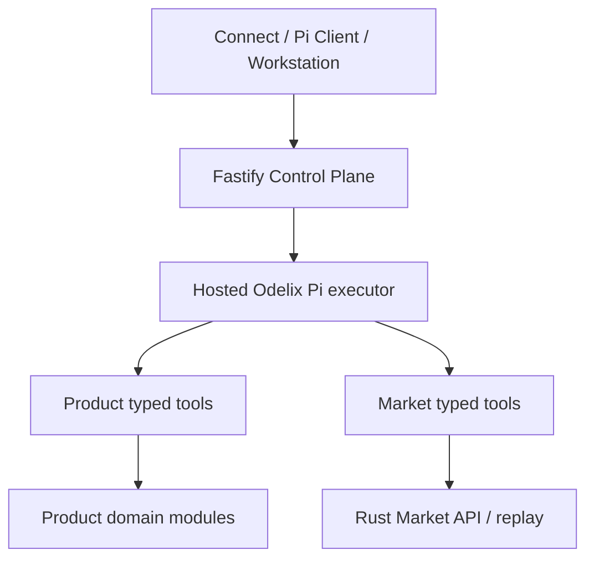

# odelix-harness — руководство разработчика

**r15.11 · 2026-09-28 · PROPOSED / не статус runtime.** В этом файле объединены локальная архитектура, контракты, карта модулей, тесты и выпуск. Подробные предметные спецификации сохранены отдельно.

[Вход в repo](../AGENTS.md) · [Локальная выборка задач](../delivery/CONTEXT.json)


<!-- BEGIN GENERATED IMPLEMENTATION BASIS -->
<a id="implementation-basis"></a>
## Основа реализации: что берём, что пишем и где интегрируем

**r15.11. Основа — maintained fork Pi, не второй wrapper-harness. Используем его agent/provider SDK; наши Skills, guards, Critic и evals строятся внутри этой основы. TradingAgents/Alpaca — выборочные доноры, Jev — условный сервис. Внешние datasets приходят из Market tools с receipt/time/AI-egress rights; отдельного OpenBB доступа у Pi нет.**

Это локальная генерируемая выборка общего решения, а не отдельный редактируемый реестр. Полные metadata — `delivery/CONTEXT.json → implementation_blueprint`. Изменения предлагает владелец repo через Coordinator; генератор обновляет общий и локальные виды вместе. Конкретный upstream/pin и supply-chain проверяются перед включением, не по наличию названия в таблице.

**Три разных зависимости:** библиотека/внешний код; внешний сервис/данные; контракт другого Odelix repo. Последний не разрешает копировать чужую реализацию. Ниже сами архитектурные bindings; реестр документальных источников в конце файла — другая сущность.

| Источник | Режим | Модули этого repo | Задачи |
|---|---|---|---|
| [TEST](#reuse-BND-026) | LIBRARY | HAR-EVL | [ODX-HAR-008](#issue-ODX-HAR-008), [ODX-HAR-009](#issue-ODX-HAR-009) |
| [PI](#reuse-BND-027) | MAINTAINED_FORK | HAR-CRT, HAR-MEM, HAR-MSN, HAR-RUN, HAR-SKL | [ODX-HAR-001](#issue-ODX-HAR-001), [ODX-HAR-002](#issue-ODX-HAR-002), [ODX-HAR-003](#issue-ODX-HAR-003), [ODX-HAR-006](#issue-ODX-HAR-006), [ODX-HAR-007](#issue-ODX-HAR-007), [ODX-HAR-010](#issue-ODX-HAR-010), [ODX-HAR-012](#issue-ODX-HAR-012), [ODX-HAR-013](#issue-ODX-HAR-013) |
| [MCP](#reuse-BND-028) | LIBRARY | HAR-CONNECT | [ODX-HAR-004](#issue-ODX-HAR-004) |
| [ALPACA](#reuse-BND-029) | SELECTIVE_PORT | HAR-CONNECT | [ODX-HAR-004](#issue-ODX-HAR-004) |
| [TA](#reuse-BND-030) | SELECTIVE_PORT | HAR-CRT, HAR-EVL, HAR-MEM, HAR-SKL | [ODX-HAR-006](#issue-ODX-HAR-006), [ODX-HAR-009](#issue-ODX-HAR-009), [ODX-HAR-011](#issue-ODX-HAR-011), [ODX-HAR-013](#issue-ODX-HAR-013), [ODX-HAR-017](#issue-ODX-HAR-017), [ODX-HAR-018](#issue-ODX-HAR-018) |
| [JEV](#reuse-BND-031) | CONDITIONAL_SERVICE_ADAPTER | HAR-EVL, HAR-MDL | [ODX-HAR-015](#issue-ODX-HAR-015), [ODX-HAR-016](#issue-ODX-HAR-016) |

<a id="reuse-BND-026"></a>
### TEST: LIBRARY

**Берём:** Vitest, fast-check, Playwright — test/property/browser harness по выбранным package pins.

**Пишем сами:** Независимые semantic oracles, negative fixtures, host/consumer integration и отчёт о выполнении.

**Не переносим / граница:** Наличие test framework или чужой зелёный CI не доказывает наш acceptance.

**Источник:** `https://vitest.dev/`. **Source pin:** `NOT_SELECTED`; для ETAPE/OPENBB это выбранная ревизия исходников, для прочих — provenance; не installed package lock. **Проверка:** `INHERITED_DECLARED_SCOPE_NOT_FRESH_SOURCE_AUDIT`.

**Предлагаемые локальные места из действующих карточек** (не подтверждённый code checkout):

| Issue / модуль | Пути |
|---|---|
| [ODX-HAR-008](#issue-ODX-HAR-008) / `HAR-EVL` | `evals/investigation/`; `evals/graders/`; `packages/odelix-evals/tests/reproducibility.test.ts` |
| [ODX-HAR-009](#issue-ODX-HAR-009) / `HAR-EVL` | `evals/adversarial/`; `packages/odelix-context/tests/handoff.test.ts`; `packages/odelix-runtime/tests/recovery.test.ts` |

<a id="reuse-BND-027"></a>
### PI: MAINTAINED_FORK

**Берём:** earendil-works/pi: SDK agent/runtime и provider packages; по возможности штатные extension interfaces.

**Пишем сами:** Приватные Skills, tools/hooks, context, Critic, evals, budgets и безопасная продуктовая конфигурация.

**Не переносим / граница:** Не копировать coding shell/tools/credentials в аналитика; не вводить второй LangGraph/AI runtime.

**Источник:** `https://github.com/earendil-works/pi/blob/main/packages/coding-agent/docs/sdk.md`. **Source pin:** `NOT_SELECTED`; для ETAPE/OPENBB это выбранная ревизия исходников, для прочих — provenance; не installed package lock. **Проверка:** `INHERITED_DECLARED_SCOPE_NOT_FRESH_SOURCE_AUDIT`.

**Предлагаемые локальные места из действующих карточек** (не подтверждённый code checkout):

| Issue / модуль | Пути |
|---|---|
| [ODX-HAR-001](#issue-ODX-HAR-001) / `HAR-RUN` | `upstream/PINNED-COMMIT`; `upstream/DIVERGENCE-LEDGER.md`; `upstream/NOTICES/`; `packages/odelix-runtime/package.json` |
| [ODX-HAR-002](#issue-ODX-HAR-002) / `HAR-RUN` | `packages/odelix-runtime/src/create-runtime.ts`; `packages/odelix-runtime/src/resource-loader.ts`; `packages/odelix-capabilities/`; `packages/odelix-runtime/tests/isolation.test.ts` |
| [ODX-HAR-003](#issue-ODX-HAR-003) / `HAR-RUN` | `packages/odelix-runtime/src/run-assignment.ts`; `packages/odelix-context/`; `packages/odelix-trace/`; `packages/odelix-runtime/tests/run-protocol.test.ts` |
| [ODX-HAR-006](#issue-ODX-HAR-006) / `HAR-SKL` | `skills/selection-explain/`; `agents/options-analyst/`; `agents/lead-investigator/`; `packages/odelix-skills/tests/selection-explain.test.ts` |
| [ODX-HAR-007](#issue-ODX-HAR-007) / `HAR-CRT` | `packages/odelix-critic/`; `policies/critic/`; `packages/odelix-critic/tests/verdicts.test.ts` |
| [ODX-HAR-010](#issue-ODX-HAR-010) / `HAR-SKL` | `skills/research-formalize/`; `skills/research-run/`; `packages/odelix-skills/tests/research-workflow.test.ts` |
| [ODX-HAR-012](#issue-ODX-HAR-012) / `HAR-MSN` | `packages/odelix-missions/`; `skills/observation-digest/`; `packages/odelix-missions/tests/wake-dedupe.test.ts` |
| [ODX-HAR-013](#issue-ODX-HAR-013) / `HAR-MEM` | `packages/odelix-memory/`; `packages/odelix-model-runtime/`; `agents/order-flow/`; `agents/options-analyst/`; `packages/odelix-memory/tests/role-context.test.ts` |

<a id="reuse-BND-028"></a>
### MCP: LIBRARY

**Берём:** Официальный MCP TypeScript SDK для protocol/schema/transport mechanics.

**Пишем сами:** Наш каталог разрешённых capabilities и mapping к единым Product/Harness use cases.

**Не переносим / граница:** MCP не бизнес-ядро; протокол не заменяет auth, grants, cost admission или agent runtime.

**Источник:** `https://ts.sdk.modelcontextprotocol.io/v2/`. **Source pin:** `NOT_SELECTED`; для ETAPE/OPENBB это выбранная ревизия исходников, для прочих — provenance; не installed package lock. **Проверка:** `INHERITED_DECLARED_SCOPE_NOT_FRESH_SOURCE_AUDIT`.

**Предлагаемые локальные места из действующих карточек** (не подтверждённый code checkout):

| Issue / модуль | Пути |
|---|---|
| [ODX-HAR-004](#issue-ODX-HAR-004) / `HAR-CONNECT` | `packages/odelix-connect/src/catalog.ts`; `packages/odelix-connect/src/transport.ts`; `packages/odelix-connect/src/output-envelope.ts`; `packages/odelix-connect/tests/mcp-conformance.test.ts`; `upstream/NOTICES/alpaca-mcp-server.md` |

<a id="reuse-BND-029"></a>
### ALPACA: SELECTIVE_PORT

**Берём:** alpacahq/alpaca-mcp-server: server.py — allowlist/metadata; security.py — разделение внешнего payload и служебного envelope.

**Пишем сами:** TypeScript capability catalogue/envelope и собственные security/conformance tests.

**Не переносим / граница:** Не переносить FastMCP, глобальные credentials, default-all tools или торговые endpoints в read-only pilot.

**Источник:** `https://github.com/alpacahq/alpaca-mcp-server/tree/9b0c72beda5579de088413ce9c3720456cde8f5f`. **Source pin:** `9b0c72beda5579de088413ce9c3720456cde8f5f`; для ETAPE/OPENBB это выбранная ревизия исходников, для прочих — provenance; не installed package lock. **Проверка:** `INHERITED_DECLARED_SCOPE_NOT_FRESH_SOURCE_AUDIT`.

**Предлагаемые локальные места из действующих карточек** (не подтверждённый code checkout):

| Issue / модуль | Пути |
|---|---|
| [ODX-HAR-004](#issue-ODX-HAR-004) / `HAR-CONNECT` | `packages/odelix-connect/src/catalog.ts`; `packages/odelix-connect/src/transport.ts`; `packages/odelix-connect/src/output-envelope.ts`; `packages/odelix-connect/tests/mcp-conformance.test.ts`; `upstream/NOTICES/alpaca-mcp-server.md` |

<a id="reuse-BND-030"></a>
### TA: SELECTIVE_PORT

**Берём:** TradingAgents: ограниченные specialist/critic procedures и test scenarios; as-of resolved outcomes для потребления памяти.

**Пишем сами:** Наши Pi Skills/Critic/evals и Memory-policy adapter к Product-owned persistence.

**Не переносим / граница:** Не TradingAgentsGraph/LangGraph runtime, не SEC importer внутри Harness и не файловый journal вместо Product storage.

**Источник:** `https://github.com/TauricResearch/TradingAgents/tree/2d17df8da1536c121e4d7395ac5a5dcec9e96d6f`. **Source pin:** `2d17df8da1536c121e4d7395ac5a5dcec9e96d6f`; для ETAPE/OPENBB это выбранная ревизия исходников, для прочих — provenance; не installed package lock. **Проверка:** `INHERITED_DECLARED_SCOPE_NOT_FRESH_SOURCE_AUDIT`.

**Предлагаемые локальные места из действующих карточек** (не подтверждённый code checkout):

| Issue / модуль | Пути |
|---|---|
| [ODX-HAR-006](#issue-ODX-HAR-006) / `HAR-SKL` | `skills/selection-explain/`; `agents/options-analyst/`; `agents/lead-investigator/`; `packages/odelix-skills/tests/selection-explain.test.ts` |
| [ODX-HAR-009](#issue-ODX-HAR-009) / `HAR-EVL` | `evals/adversarial/`; `packages/odelix-context/tests/handoff.test.ts`; `packages/odelix-runtime/tests/recovery.test.ts` |
| [ODX-HAR-011](#issue-ODX-HAR-011) / `HAR-CRT` | `skills/research-review/`; `policies/critic/research/`; `evals/research/`; `packages/odelix-skills/tests/research-review.test.ts` |
| [ODX-HAR-013](#issue-ODX-HAR-013) / `HAR-MEM` | `packages/odelix-memory/`; `packages/odelix-model-runtime/`; `agents/order-flow/`; `agents/options-analyst/`; `packages/odelix-memory/tests/role-context.test.ts` |
| [ODX-HAR-017](#issue-ODX-HAR-017) / `HAR-CRT` | `skills/agent-postmortem/`; `tests/agent-postmortem.test.ts` |
| [ODX-HAR-018](#issue-ODX-HAR-018) / `HAR-SKL` | `agents/investigation-team/`; `skills/position-observer/`; `tests/investigation-team.test.ts` |

<a id="reuse-BND-031"></a>
### JEV: CONDITIONAL_SERVICE_ADAPTER

**Берём:** TypeSafe Jev, официальный @typesafe-ai/sdk за SemanticEvaluatorPort.

**Пишем сами:** Версионированный input/questions, typed assessments, cache/budgets/failure и отдельный eval. Check audit/user_memory/eval/training individually; no inference from one permission to another.

**Не переносим / граница:** Никакой математики рынка в Jev; confidence не forecast; модель не dependency raw-графика.

**Источник:** `https://docs.typesafe.ai/sdk/javascript`. **Source pin:** `jev-1.13.0 observed 2026-09-20; SDK adoption pin NOT_SELECTED`; для ETAPE/OPENBB это выбранная ревизия исходников, для прочих — provenance; не installed package lock. **Проверка:** `INHERITED_DECLARED_SCOPE_NOT_FRESH_SOURCE_AUDIT`.

**Предлагаемые локальные места из действующих карточек** (не подтверждённый code checkout):

| Issue / модуль | Пути |
|---|---|
| [ODX-HAR-015](#issue-ODX-HAR-015) / `HAR-MDL` | `packages/semantic-evaluator/src/providers/typesafe.ts`; `packages/semantic-evaluator/tests/typesafe.test.ts`; `evals/semantic/` |
| [ODX-HAR-016](#issue-ODX-HAR-016) / `HAR-EVL` | `evals/semantic/`; `packages/semantic-evaluator/`; `tests/semantic_eval.test.ts` |

### Сервисы и datasets: прямые, общие и отложенные подключения

Только direct Issue означает scope конкретного подключения. Related/generic — класс работ, не выбранный provider. Future/deferred строки не надо реализовывать автоматически; они сохранены, чтобы отдельный repo не потерял архитектурный замысел.

| Источник | Покрытие | Прямые задачи | Связанный общий scope | Решение/условие |
|---|---|---|---|---|
| TypeSafe Jev / @typesafe-ai/sdk | EXPLICIT | `ODX-STK-012`, `ODX-HAR-015`, `ODX-HAR-016` |  | Заменяемый semantic evaluator и shadow experiment; legal/data/budget gate. Не математический движок и не доказанный forecast. Четыре permissions: audit/user_memory/eval/training, независимые.; 2–3 |
| Provider-neutral LLM access / Pi provider packages | GENERIC_SCOPE |  | `ODX-HAR-001`, `ODX-HAR-002`, `ODX-HAR-003`, `ODX-HAR-013`, `ODX-PRD-007` | Путь через Pi предусмотрен; отдельный список выбранных коммерческих моделей и договоров не зафиксирован. Выбор по eval, не по произвольному новому названию.; 2 и далее |
| OpenTelemetry + Prometheus/Grafana либо compatible backend | GENERIC_SCOPE |  | `ODX-STK-009`, `ODX-HAR-003` | OTel-инструментация есть в scopes. Конкретный managed telemetry backend и самостоятельная задача его закупки не определены.; 1–2 |

### Унаследованные варианты — не дополнительные зависимости

Связь по source group не доказывает выбор каждого пакета. Ниже сохранены reference-кандидаты, связанные с локальными sources. Более старые решения могут расходиться с текущим scope; не разрешать их молча.

| Компонент | Исторический статус | Роль/граница |
|---|---|---|
| [Pi](https://github.com/earendil-works/pi) | `FORK / OWNED FOUNDATION` | Весь Odelix Harness: runtime, skills/hooks/tools/teams/rules, Critic, memory, Missions, traces and evals; Exact upstream commit + patch digest; no external wrapper; Product/Market domain schemas remain producer-owned |
| [Official MCP TypeScript SDK](https://github.com/modelcontextprotocol/typescript-sdk) | `ADOPT-LIMITED` | Transport/protocol projection для builder surface; MCP schemas map к тем же application commands/queries/policy; не в domain |
| Pi provider packages / direct provider SDKs | `FORK FOUNDATION / ADOPT-LIMITED` | Model/provider access внутри Pi fork; HarnessVersion pin, Product secret binding, one provider path per run |
| [fast-check](https://github.com/dubzzz/fast-check) | `ADOPT` | Property/model-based tests TypeScript domain/contract paths; Pinned seeds сохраняются как reproducible fixtures |

### Ранний внешний data layer (генерируемый scope)

OpenBB ODP SELECTED_FOR_IMPLEMENTATION, runtime NOT_RUN; в этом repo применяются только его обязанности. Native flow/replay и права не подменяются внешним snapshot. Полный normative contract принадлежит Market; consumer получает producer artifact.

| Profile | Mode | Доказанная граница / ограничения | Issues |
|---|---|---|---|
| ODP-DERIBIT-BARS | HISTORICAL_POLL | explicit date range; no full-history default; source precision preserved, not exact exchange reconstruction; no aggression/price-bin data | `ODX-MKT-091` |
| ODP-ECB-REFERENCE | DATED_CURRENT_SNAPSHOT | daily.xml, not historical series; not executable intraday FX price; observation date not exact publication timestamp | `ODX-MKT-091` |
| ODP-DERIBIT-CHAIN | COMPOSITE_CURRENT_SNAPSHOT | one connection per expiry in upstream, require measured fanout cap; 2s per expiry receive timeout; partial/exceptions not complete proof; BTC/ETH price conversion to USD and round(2); IV percent divided by 100; New York aware row timestamps normalized to UTC preserving instant; contract_size=1 and today-derived DTE are not verified terms; date-only expiry and current universe do not supply historical PIT | `ODX-MKT-037`, `ODX-WKS-021` |
| ODP-FRED-REVISED-PREVIEW | DISABLED_API_PROFILE_NOT_PERSONAL_FILE_ROUTE | Not installed/selected as active ODP fallback; FRED general restrictions apply beyond API: personal download not corpus storage; Use separate bounded personal file policy; no automated ODP/ML route | `ODX-MKT-090`, `ODX-MKT-042`, `ODX-MKT-043`, `ODX-MKT-044` |

Cache/replay policy: source+model+canonical instrument+query+normalization version+rights credential partition; reauthorize on hit; no silent provider fallback. stored OpenBB response plus versioned deterministic normalization, not upstream event replay; no vendor call during saved replay. Public activation: requires actual Product grants, source/AGPL/data rights and operational acceptance; local preview is not public authorization.

**Приёмка внешнего компонента:** existing-code check → точный package/commit и license/NOTICE/dependencies → adapter test с недоступностью/ошибками/качеством → фактический pin и результат. Не создавать второй runtime/численный engine под видом ускорения. Текст этого блока не устанавливает packages, не покупает сервисы и не выдаёт production rights.
<!-- END GENERATED IMPLEMENTATION BASIS -->

<a id="architecture"></a>
## Архитектура


### Decision

`odelix-harness` is a maintained fork of Pi and the only product agent
runtime. There is no Odelix harness outside it.

### Runtime shape



S0 embeds an exact private fork package in Product Host. The repository and
release are separate; the process may be shared. Product injects tool bindings,
capability context, trace sink and clock. At S1/S2 the same Run contract moves
to fenced workers. Fastify/queue decides when/where; Pi alone decides how.

### Internal modules

`HAR-RUN`, `HAR-CTX`, `HAR-SKL`, `HAR-CAP`, `HAR-MDL`, `HAR-CRT`,
`HAR-TRC`, `HAR-EVL`, `HAR-CONNECT`; later `HAR-MEM`, `HAR-MSN`.

Upstream-derived `ai`, `agent` and `telemetry` packages remain. Coding
agent/TUI may remain for upstream compatibility but are not trading UX.

### Dependency direction

```text
Connect/Product/Workstation transport → public Odelix Harness API
HAR-RUN → SKL/CTX/CAP/MDL/CRT/TRC
HAR-EVL → immutable run/replay/evidence artifacts
HAR-CAP → injected Product/Market tool contracts
```

No module imports Product/Market implementation. Domain truth never moves into
the fork. No second agent framework is allowed.

### Upstream policy

Every release records upstream commit, Odelix patch digest, conformance
report, AlphaEval report, license/notices and rollback. Target core patch count
is zero. Exception requires approved divergence/removal/upstream plan. Upstream
sync receives a bounded 0.5 founder-day every 2–4 weeks and is staged: upstream
tests → Odelix contract tests → AlphaEval → explicit promotion.

The first useful surface is an early browser Workstation on the existing Market. Connect is a compatible API/MCP channel, not a UI prerequisite. Later Desktop/professional expansion calls
the same hosted Skills; it does not embed private machinery.


### Options и research integration (PROPOSED)

Options parse/explain/critique uses existing HAR-SKL/CRT/CAP/EVAL interfaces. Private hosted machinery remains server-side. Deterministic raw tools also work with external agents not using Pi.

Detailed scope: [OPTIONS-WORKFLOW.md](#DEP-2fd02fb327).


### Research/strategy capability requirements

Managed research procedures, bounded per-agent context и memory proposals. Основные owners: HAR-RUN/CTX/SKL/MEM/CRT.

Новая поверхность использует эти же contracts и semantic fixtures; численные/торговые engines не копируются в UI или prompts. MODULE описывает actual/planned paths раздельно.


### Product workflows and ownership


Один Run — ограниченная задача с целью, состоянием, инструментами и проверяемым завершением. Агент получает результат tool, оценивает, достаточно ли данных, выбирает следующий разрешённый шаг, повторяет или останавливается. Обязательные checks, финансовая математика и полномочия не зависят от решения модели.

| Компонент | Ответственность | Что пользователь может проверить |
|---|---|---|
| HAR-RUN / Pi | Session, agent loop, stage state, bounded delegation, cancellation и checkpoints | Состояние, progress, причины остановки |
| HAR-SKL | Версионированная исследовательская процедура и её eligibility | Какая процедура применена и что она обязана проверить |
| HAR-CTX | Ролевая проекция authoritative Context Package, token accounting, retrieval и handoff | Scope, asOf, sources, omissions, memory refs |
| HAR-CAP + hook chain | Tool grants, schema/rights/temporal checks, side-effect guards | Разрешённые действия и конкретный отказ |
| HAR-MDL | Выбор и fallback модели по роли, чувствительности, eval status и бюджету | Provider/model version и факт деградации |
| HAR-CRT | Независимая проверка material claims, альтернатив и необходимых данных | Objections, ограничения и verdict |
| HAR-TRC | Упорядоченные действия, tool results, Evidence и краткие основания | Trace без скрытого chain-of-thought |
| HAR-MEM | Memory candidates, policy, conflicts, expiry и retrieval | Что предлагается запомнить, почему и на какой срок |
| HAR-MSN | Пробуждение и продолжение ограниченных Missions | Trigger, следующий review, budget, pause |
| HAR-EVL | Frozen episodes, quality/cost comparison и admission новой версии | Scorecard, scope и ограничения оценки |
| HAR-CONNECT | Доставка capabilities чужим агентам | Те же typed results, permissions и run IDs |

Product control plane проверяет приём, tenant/entitlement, сохраняет business objects, размещает Run и durable state. Pi определяет исследовательские шаги. Rust Market вычисляет рыночные числа и replay. Execution владеет приказами, fills и финансовыми действиями. Эти владельцы не меняются, когда агент вызывает их tools.

Prompt stack: неизменяемые policies → role contract → run/budget → Skill → цель/Mission → immutable market/object refs → разрешённая память → evidence → текущий вопрос. Рыночные данные и внешние тексты не становятся системными инструкциями. Retrieved content не может выдавать себе новые права.


Mission goal/revisions are durable Product objects; HAR-MSN owns wake/execution policy, checkpoints and bounded continuation. Agent Builder configures the same capabilities; it does not introduce another loop. First managed Investigation delivery does not depend on a full custom-strategy backtester.


### Workstation-first r15: текущая приёмка

Один Pi + отдельная bounded fixed-question capability за SemanticEvaluatorPort, не второй agent loop. Jev условный заменяемый adapter; transport/semantic quality/forecast три разные проверки.

Каноническая детализация: [SEMANTIC-EVALUATOR.md](AI-HARNESS-AND-INTELLIGENCE-PLATFORM.md#semantic-evaluator); [current delivery](#DEP-b335630551).


<a id="contracts"></a>
## Контракты

**Статус этой сборки:** перечисленные семейства — спецификация. Заголовок «Published» в унаследованном тексте означает целевую поверхность публикации, не доказательство существующего release. Реальный pin/digest и conformance требуются до integration acceptance.


### Published

- `harness.runtime.v1`: `createOdelixHarness(...)`, `RunRequest`,
  `AgentSessionRef`, `TerminalOutcome` and `HarnessVersionManifest`; consumed by
  Product Host only;
- `harness.events.v1`: `HarnessEvent` and client projections; transported by
  Product and consumed by Connect/Pi Client/Workstation without importing the runtime;
- `harness.tool.v1`: Skill/Agent/Team/Tool manifests and capability schema;
- `harness.trace.v1`: redacted Run Trace, `CriticVerdict` and
  `ProcedureVerification` envelopes;
- `harness.eval.v1`: episode, scorecard and promotion-result envelopes.
- `harness.connect.v1`: MCP capability projection for raw tools and managed
  Skills; transport only, no workflow semantics.

### Consumed

- Product: Context/Evidence/Thesis/Watch/Experiment/Capital read and draft tools;
- Platform: tenant, capability, entitlement, usage reservation/settlement,
  `RunLease`, checkpoint and worker-assignment bindings;
- Market: PIT state, replay and deterministic calculator schemas.

Connect/Pi Client/Workstation do not receive private Pi machinery. They issue
start/cancel/follow-up commands through Product transport and consume
`harness.events.v1` projections.

Consumers pin exact package/schema digest while DRAFT. Cross-repository public
types are Odelix types, not private Pi internals. Tool contracts keep
semantic ownership with Product/Market producer.

### Prohibitions

- no `AgentKernelPort` or `pi-agent-kernel-adapter`;
- no self-HTTP when embedded in Product Host;
- no direct database/journal/source imports;
- no second orchestration/runtime state;
- no untyped tool result;
- no tool capability inferred from subscription, prompt or agent role.
- no `ODELIX_PROCEDURE_VERIFIED` for raw/BYO-harness composition;
- no agent routing in Product/queue/worker contracts;
- no downloadable artifact containing private Skill/hook/agent/Critic/eval data.


### Options и research integration (PROPOSED)

MKT-OSC/OPT owns economics; Execution owns signed permission/fill state. Tool descriptors identify read/compute/draft/RFQ/trade side effects. No LLM private key or autonomous trading through raw OAuth scope.

Detailed scope: [OPTIONS-WORKFLOW.md](#DEP-2fd02fb327).


### Research/strategy capability requirements


Общие StrategySpec/ExperimentSpec — Product; calculation/data manifests — Market; agent handoff — Harness; order/policy — Execution. Schema producer owns source, Stack registry discovers it. DRAFT entries не считаются published; copy/paste бизнес-типов между repos запрещён.


<a id="modules"></a>
## Модули


| ID | Module | Owns | CURRENT_PLAN |
|---|---|---|---|
| HAR-RUN | run-runtime | AgentSession/Run lifecycle, budgets, cancel, terminal commit | yes |
| HAR-CTX | context-policy | provider-safe projection, redaction, compaction | yes |
| HAR-SKL | trading-skills | skill/team manifests, routing, steps, stop/output rules | yes |
| HAR-CAP | capabilities | tool registry, grants, side-effect classes, audit | yes |
| HAR-MDL | model-runtime | provider/model binding, streaming, structured output, cost | yes |
| HAR-CRT | critic | isolated critique, block/repair verdict | yes |
| HAR-TRC | trace-version | HarnessVersionManifest, immutable run events and lineage | yes |
| HAR-EVL | evaluation | AlphaEval episodes, graders, scorecards, promotion | yes |
| HAR-CONNECT | connect-projection | MCP/API capability projection and client events; no orchestration | CONNECT_COMMERCIAL |
| HAR-MEM | memory-policy | typed candidate refs, provenance, expiry, user control | minimal/later |
| HAR-MSN | missions | wake, schedule/event trigger, dedupe, checkpoint/recovery | later |

These are packages/directories inside one Pi fork, not services. Only active
modules receive detailed [MODULE-шаблон](../templates/MODULE.md).


### Актуальные подробные спецификации

| ID | Gate | MODULE |
|---|---|---|
| HAR-CTX | I1 | [HAR-CTX](../modules/context/MODULE.md) |
| HAR-MEM | I1/Expansion | [HAR-MEM](../modules/memory/MODULE.md) |
| HAR-RUN | C1/I1 | [HAR-RUN](../modules/run-runtime/MODULE.md) |
| HAR-SKL | I1/RES-1 | [HAR-SKL](../modules/trading-skills/MODULE.md) |


<a id="testing"></a>
## Проверка


**Уточнение scope Research: r12.1 · 2026-09-18.** Пользовательские примеры не определяют встроенную стратегию или обязательный dataset; статус реализации не меняется.

- upstream package test suite;
- `AGT-013_single_pi_runtime_path` dependency/repository conformance;
- `AGT-014_no_result_laundering` result-profile/signature tests;
- `AGT-015_downloadable_artifact_has_no_private_machinery` content/SBOM scan;
- `AGT-016_control_plane_has_no_agentic_routing` dependency/config test;
- `AGT-017_fenced_single_active_turn` crash/retry/tenant isolation test;
- `AGT-018_managed_skill_beats_pinned_raw_tools_baseline` blinded eval report;
- `AGT-019_zero_core_patch_or_approved_divergence` core-diff CI;
- tool schema/capability/tenant/budget/expiry/idempotency matrices;
- forced cancel/timeout/provider/tool failures and no-partial-commit assertions;
- Context projection/redaction and screenshot-conflict cases;
- Critic input isolation and invocation-order trace;
- exact HarnessVersionManifest/upstream/patch digest tests;
- Product/Market contract fixtures across package boundary;
- replay future-data firewall and deterministic Evidence digest;
- AlphaEval frozen episodes including `NO_CONCLUSION`, stale/gap, injection and
  unsupported material Claim;
- upstream merge rehearsal and rollback drill.

Prompt/model quality never compensates a failed invariant test.


### Options и research integration (PROPOSED)

Test ambiguous protection intent, false max-loss/profit claims, stale data, quote/mark confusion, prompt-injection, supported-agent parity and managed-versus-raw blinded evaluation. OPT-018 adds no numeric authority.

Detailed scope: [OPTIONS-WORKFLOW.md](#DEP-2fd02fb327).


### Research/strategy capability requirements


Meaningful acceptance scenarios: context compaction/resume, insufficient data abstention, unresolved user-defined formula/entry/exit parameters, tenant isolation, procedure versus profitability distinction. Здесь перечислены planned tests; executed results должны ссылаться на commit/CI.


<a id="runbook"></a>
## Выпуск и эксплуатация


Before release:

1. confirm A0 is closed for implementation release;
2. record upstream commit and Odelix patch digest;
3. prove core patch count = 0 or validate every approved divergence entry;
4. run upstream tests unchanged where applicable;
5. run Odelix tool/capability/trace conformance;
6. run frozen AlphaEval and raw-tools moat-delta baseline;
7. verify artifact scan, tenant isolation, fenced active turn, budgets and cancellation;
8. publish package/schema digests and rollback version;
9. update stack compatibility manifest.

Incident safe reactions:

- provider failure → typed `TOOL_FAILED/FAILED/NO_CONCLUSION`;
- budget exhaustion → `BUDGET_EXHAUSTED`;
- capability mismatch → `POLICY_BLOCKED`;
- stale/gapped market input → `INSUFFICIENT_DATA` or qualified output;
- trace sink failure before required commit → fail closed;
- upstream regression → pin previous fork release.

Never hot-edit production Skill/policy/runtime during a Run.

Every 2–4 weeks reserve up to half a founder-day for upstream fetch/rebase
rehearsal, tests and `UPSTREAM-SYNC-LOG`. No automatic production promotion.


### Options и research integration (PROPOSED)

Disable unsupported options skills without breaking raw/synthetic arithmetic. Preserve trace, zero-core-patch, upstream pin and managed release/eval checks; never hot-edit policy during a Run.

Detailed scope: [OPTIONS-WORKFLOW.md](#DEP-2fd02fb327).


### Research/strategy capability requirements


Начинать с inventory существующего кода/Issues. Глобальный порядок и A0 находятся в `DEP-9359295523` (см. локальный реестр зависимостей); Project metadata включает нормализованный Module согласно r15.3; дополнительные поля не добавляются автоматически. Не добавлять ручной второй статус-журнал.


<a id="early-external-data"></a>
<a id="ранняя-data-ветка-r158-реализация-и-владельцы"></a>
## Ранняя data-ветка: реализация и владельцы

OpenBB не подключается напрямую к Pi и не становится ещё одним tool runtime. [Полная AI-спецификация](AI-HARNESS-AND-INTELLIGENCE-PLATFORM.md#external-data-context) описывает Odelix tools с producer-owned query/capability/receipt metadata. Роль Harness — проверить suitability, время, источник и допустимость AI egress.

Обычные свечи не позволяют заявить поглощение/CVD/полную ликвидность; chain snapshot не tape или dealer inventory. При missing native inputs возвращать qualified/unsupported analysis. Модель не превращает сохранённый внешний ответ в historical PIT и не делает арифметику supplier округлений точной.

Source/normalizer pin, prior response revision и rights version входят в bounded context и trace. Не переоценивать старый result молча на новом запросе к provider.
<!-- R159 agent-runtime-ports -->
## Ранние hosted Missions и донорские процедуры

HAR-012 получает готовый trigger/mandate, исполняет bounded observation procedure и возвращает typed result. Research/Thesis review выделен HAR-020; отсутствие этого Skill или Jev не блокирует простой digest. Product хранит расписание, lease/record projections и outbox; Harness не берёт ownership Agent Registry или deployment.

Read-only post-mortem HAR-017 и advanced team HAR-018 используют разрешённые DecisionRecord inputs. Границы переносов — [AGENT-DONOR-IMPORT](../delivery/AGENT-DONOR-IMPORT.json); third-party graph, broker runtime и risk-agent как numerical authority не импортируются.

No-egress input не отправляется модели; модельный ключ не меняет эти права. Deribit personal target и bounded FRED personal files не являются разрешёнными AI inputs сами по себе; corpus/egress/AI права проверяются до Run. FRED API fallback отключён.

<!-- BEGIN GENERATED REPO CONTEXT -->

<a id="modules-index"></a>
## Каталог модулей этой области

Один primary owner в каждой задаче; affected modules отдельно. AREA — служебная классификация. Идентификаторы сохранены. Activation — scope текущего плана, не доказательство исполнения; независимый implementation_status в JSON.

| ID | Вид | Activation | Источник в этом repo |
|---|---|---|---|
| `HAR-CAP` | MODULE | ACTIVE | [docs/DEVELOPMENT.md](#modules) |
| `HAR-CONNECT` | MODULE | ACTIVE | [docs/DEVELOPMENT.md](#modules) |
| `HAR-CRT` | MODULE | ACTIVE | [docs/DEVELOPMENT.md](#modules) |
| `HAR-CTX` | MODULE | ACTIVE | [modules/context/MODULE.md](../modules/context/MODULE.md) |
| `HAR-EVL` | MODULE | ACTIVE | [docs/DEVELOPMENT.md](#modules) |
| `HAR-MDL` | MODULE | ACTIVE | [docs/DEVELOPMENT.md](#modules) |
| `HAR-MEM` | MODULE | ACTIVE | [modules/memory/MODULE.md](../modules/memory/MODULE.md) |
| `HAR-MSN` | MODULE | ACTIVE | [docs/DEVELOPMENT.md](#modules) |
| `HAR-RUN` | MODULE | ACTIVE | [modules/run-runtime/MODULE.md](../modules/run-runtime/MODULE.md) |
| `HAR-SKL` | MODULE | ACTIVE | [modules/trading-skills/MODULE.md](../modules/trading-skills/MODULE.md) |
| `HAR-TRC` | MODULE | ACTIVE | [docs/DEVELOPMENT.md](#modules) |

<a id="work-queue"></a>
## Локальная очередь и следующий шаг

Полный текст каждой задачи — в [delivery/CONTEXT.json](../delivery/CONTEXT.json), это автоматически полученная выборка, не второй редактируемый backlog. Найдите объект по `id`, прочитайте `work`, `acceptance`, `paths`, `depends_on`, `primary_module_id`.

Сначала действующий Issue, actual commit/permissions, затем следующее допустимое действие. Planned wave не статус и не мандат. Внешняя зависимость должна предоставить артефакт/fixture; соседний checkout не предполагается.

| ID | Модуль | Волна | Результат | Зависимости |
|---|---|---|---|---|
| <a id="issue-ODX-HAR-001"></a>`ODX-HAR-001` | `HAR-RUN` | 2 | Подготовить maintained Pi fork, pin и reproducible package | ODX-STK-008 |
| <a id="issue-ODX-HAR-002"></a>`ODX-HAR-002` | `HAR-RUN` | 2 | Создать безопасный Pi runtime profile без coding tools | ODX-HAR-001 |
| <a id="issue-ODX-HAR-003"></a>`ODX-HAR-003` | `HAR-RUN` | 2 | Реализовать Harness protocol: budget, events, checkpoint и trace | ODX-HAR-002, ODX-PRD-004 |
| <a id="issue-ODX-HAR-004"></a>`ODX-HAR-004` | `HAR-CONNECT` | 6 | Подключить официальный MCP SDK и адаптировать Alpaca allowlist/envelope | ODX-HAR-003, ODX-PRD-004 |
| <a id="issue-ODX-HAR-005"></a>`ODX-HAR-005` | `HAR-CAP` | 3 | Связать typed Market/Product tools и preflight/result guards | ODX-PRD-007, ODX-MKT-019, ODX-MKT-007 |
| <a id="issue-ODX-HAR-006"></a>`ODX-HAR-006` | `HAR-SKL` | 3 | Написать первый options-aware Investigation Skill | ODX-HAR-005 |
| <a id="issue-ODX-HAR-007"></a>`ODX-HAR-007` | `HAR-CRT` | 3 | Реализовать independent Critic и bounded repair | ODX-HAR-006 |
| <a id="issue-ODX-HAR-008"></a>`ODX-HAR-008` | `HAR-EVL` | 3 | Подготовить frozen evaluation и raw-tools baseline | ODX-HAR-007, ODX-MKT-007 |
| <a id="issue-ODX-HAR-009"></a>`ODX-HAR-009` | `HAR-EVL` | 4 | Провести adversarial, context-overflow и package-isolation проверки | ODX-HAR-008 |
| <a id="issue-ODX-HAR-010"></a>`ODX-HAR-010` | `HAR-SKL` | 5 | Написать research formalization и execution Skills | ODX-PRD-018, ODX-HAR-007 |
| <a id="issue-ODX-HAR-011"></a>`ODX-HAR-011` | `HAR-CRT` | 5 | Добавить research Critic и объяснение сравнения вариантов | ODX-HAR-010, ODX-PRD-019 |
| <a id="issue-ODX-HAR-012"></a>`ODX-HAR-012` | `HAR-MSN` | 3 | Реализовать sleeping/waking Mission на том же Pi Run protocol | ODX-HAR-003, ODX-PRD-022, ODX-PRD-024, ODX-MKT-006 |
| <a id="issue-ODX-HAR-013"></a>`ODX-HAR-013` | `HAR-MEM` | 9 | Подключить Memory policy, model routing и specialist expansion | ODX-HAR-012, ODX-HAR-020, ODX-PRD-026, ODX-MKT-016 |
| <a id="issue-ODX-HAR-014"></a>`ODX-HAR-014` | `HAR-MDL` | 2 | Опубликовать SemanticEvaluatorPort и fixed-question runtime | ODX-HAR-003, ODX-MKT-019 |
| <a id="issue-ODX-HAR-015"></a>`ODX-HAR-015` | `HAR-MDL` | 2 | Добавить Jev adapter и ограниченный shadow experiment | ODX-HAR-014, ODX-STK-012 |
| <a id="issue-ODX-HAR-016"></a>`ODX-HAR-016` | `HAR-EVL` | 3 | Сравнить semantic interpretation с baseline и prospective shadow | ODX-HAR-015, ODX-MKT-022, ODX-PRD-028 |
| <a id="issue-ODX-HAR-020"></a>`ODX-HAR-020` | `HAR-MSN` | 5 | Подключить Research/Thesis Critic к базовым Missions | ODX-HAR-012, ODX-HAR-011, ODX-PRD-037, ODX-MKT-019 |
| <a id="issue-ODX-HAR-017"></a>`ODX-HAR-017` | `HAR-CRT` | 3 | Добавить post-mortem Skill над разрешёнными DecisionRecords | ODX-HAR-007, ODX-PRD-032 |
| <a id="issue-ODX-HAR-018"></a>`ODX-HAR-018` | `HAR-SKL` | 6 | Адаптировать Investigation Team и read-only Position Guard | ODX-HAR-006, ODX-HAR-007, ODX-HAR-014, ODX-PRD-032 |
| <a id="issue-ODX-HAR-019"></a>`ODX-HAR-019` | `HAR-RUN` | 6 | Опционально добавить sanitized Pi client в PAPER Node | ODX-HAR-001, ODX-HAR-002, ODX-EXE-011 |

<a id="dependencies"></a>
## Внешние зависимости и источники

**Реестр ниже не является очередью обязательного чтения.** Большинство записей — происхождение решений; артефакт запрашивается только для конкретной необходимой зависимости задачи. **Независимость checkout не означает отсутствие зависимостей продукта.** Здесь записаны логические координаты издателя, а не относительные переходы в соседнюю папку. `source_sha256` в локальном JSON удостоверяет только исходный документ r15.3. Ни одна строка не является доказательством выпуска schema/SDK.

Для конкретной задачи получить через TaskPacket или разрешённый артефактный канал: producer + contract ID, точный release/commit, schema/package digest, fixtures, consumer-conformance и разрешённые операции. Записать фактический локальный путь после получения; пока artifact не предоставлен, зависимая runtime-работа не готова. Локальные fixture/design-задачи возможны по своему мандату.

Не заменять чужую схему её ручной копией. Обновление версии — producer release → consumer pin → conformance → интеграция. Разрешение читать артефакт не даёт права изменять другой repo.

| Ref | Publisher | Логический источник | Статус исходника |
|---|---|---|---|
| <a id="DEP-143d61eff7"></a>`DEP-143d61eff7` | `odelix-stack` | `reference/OSS-REVIEW-RU.md` | DOCUMENT_SNAPSHOT_ONLY |
| <a id="DEP-2fd02fb327"></a>`DEP-2fd02fb327` | `odelix-product` | `docs/OPTIONS-WORKFLOW.md` | DOCUMENT_SNAPSHOT_ONLY |
| <a id="DEP-4cc69c028e"></a>`DEP-4cc69c028e` | `odelix-stack` | `docs/DELIVERY-ROADMAP.md` | DOCUMENT_SNAPSHOT_ONLY |
| <a id="DEP-52ea262d35"></a>`DEP-52ea262d35` | `odelix-stack` | `docs/INTEGRATIONS.md#code-reuse` | DOCUMENT_SNAPSHOT_ONLY |
| <a id="DEP-55b72d67f4"></a>`DEP-55b72d67f4` | `odelix-stack` | `docs/05-CONTRACTS-AND-INTEGRATION.md` | DOCUMENT_SNAPSHOT_ONLY |
| <a id="DEP-568bec8dbe"></a>`DEP-568bec8dbe` | `odelix-workstation` | `docs/WORKSTATION-SPEC.md` | DOCUMENT_SNAPSHOT_ONLY |
| <a id="DEP-5f239351cd"></a>`DEP-5f239351cd` | `odelix-stack` | `reference/EXTERNAL-SOURCE-REVIEW-2026-09-20.md` | DOCUMENT_SNAPSHOT_ONLY |
| <a id="DEP-628b324d94"></a>`DEP-628b324d94` | `odelix-stack` | `adr/ADR-010-WORKSTATION-FIRST-SEMANTIC-FLOW.md` | DOCUMENT_SNAPSHOT_ONLY |
| <a id="DEP-9359295523"></a>`DEP-9359295523` | `odelix-stack` | `docs/DELIVERY-RUNBOOK.md` | DOCUMENT_SNAPSHOT_ONLY |
| <a id="DEP-b18ccf612f"></a>`DEP-b18ccf612f` | `odelix-product` | `docs/STRATEGY-RESEARCH-AND-EXECUTION.md` | DOCUMENT_SNAPSHOT_ONLY |
| <a id="DEP-b335630551"></a>`DEP-b335630551` | `odelix-stack` | `AGENTS.md` | DOCUMENT_SNAPSHOT_ONLY |
| <a id="DEP-da216e3915"></a>`DEP-da216e3915` | `odelix-stack` | `templates/MODULE.md` | DOCUMENT_SNAPSHOT_ONLY |

`UNRESOLVED_SOURCE_REFERENCE` — отсутствующий документ/якорь исходного пакета явно зарегистрирован; содержание не придумано. Для historical source его можно оставить архивной ссылкой, для обязательной зависимости — запросить источник. Public URLs в предметных документах сохранены как датированные ссылки и не проверялись онлайн этой сборкой.
